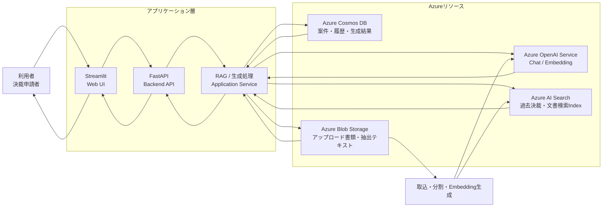
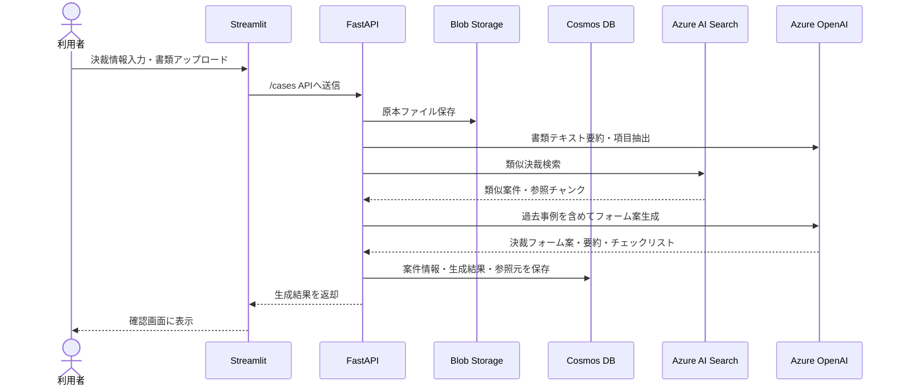
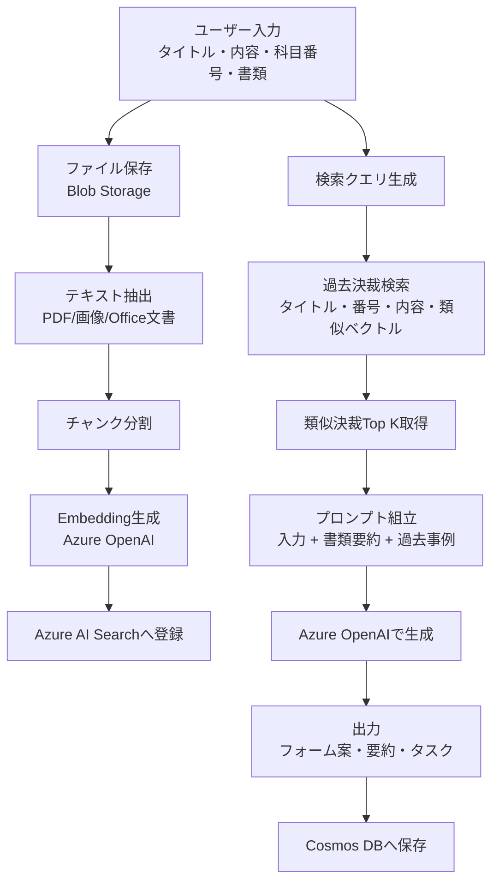
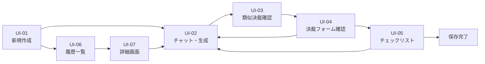

# 生成AIによる決裁書類作成支援Webアプリ 設計書・仕様書

## 1. 企画概要

### 1.1 システム名

**決裁RAGアシスタント**

### 1.2 背景

社内の決裁業務では、請求書・見積書・契約書・稟議資料など複数の書類を確認し、決裁タイトル、金額、決裁科目番号、記載内容、添付書類、確認タスクを手作業で整理する必要がある。  
また、過去の類似決裁を参照して記載粒度や必要書類を確認する作業にも時間がかかる。

本システムでは、アップロードされた決裁関連書類とユーザー入力をもとに、Azure OpenAI Service と Azure AI Search による RAG を活用し、過去事例を参照しながら決裁入力フォーム案・要約・チェックリストを自動生成する。

### 1.3 目的

- 決裁書類作成に必要な情報整理の時間を削減する
- 過去の類似決裁を自動検索し、記載漏れ・添付漏れを防ぐ
- 請求書等のアップロード書類から、金額・取引先・日付・件名などを抽出する
- 決裁入力フォームに転記しやすい形式で出力する
- 作成結果と参照した過去事例を蓄積し、次回以降の検索精度を高める

### 1.4 想定利用者

- 決裁申請を行う社員
- 申請内容を確認する管理者・承認者
- 経理・総務・調達部門など、決裁関連書類を扱う担当者

## 2. システム全体像

### 2.1 利用技術

| 区分 | 採用技術 | 用途 |
|---|---|---|
| フロントエンド | Streamlit | チャットUI、ファイルアップロード、結果確認画面 |
| バックエンド | FastAPI | API、RAG処理、Azure連携、データ保存 |
| 生成AI | Azure OpenAI Service | 要約、項目抽出、チェックリスト生成、フォーム生成 |
| 検索/RAG | Azure AI Search | 過去決裁情報・書類チャンクの類似検索 |
| DB | Azure Cosmos DB | 決裁案件メタデータ、生成結果、履歴、ユーザー操作ログ |
| ファイル保存 | Azure Blob Storage | アップロード書類、抽出テキスト、生成済み成果物 |
| 開発言語 | Python | Streamlit/FastAPI/Azure SDK |

### 2.2 使用予定Azureリソース

| カテゴリ | リソース名・方針 |
|---|---|
| リソースグループ | `20260526_forPBL` |
| Azure OpenAI | `20260526-forPBL-aoai` |
| Azure AI Search | アカウント番号が奇数: `20260526forpblaisearch` / 偶数: `20260526forpblaisearch2` |
| Blob Storage | 各自作成。例: `{氏名}-pbl-decision-storage` |
| Cosmos DB | 必要に応じて各自作成。例: `{氏名}-pbl-decision-cosmos` |

## 3. システムアーキテクチャ

### 3.1 アーキテクチャ図



### 3.2 データフロー図



### 3.3 RAG処理の詳細



## 4. 画面設計

### 4.1 画面一覧

| 画面ID | 画面名 | 主な役割 |
|---|---|---|
| UI-01 | ホーム/新規作成画面 | 決裁情報入力、書類アップロード、生成開始 |
| UI-02 | チャット・生成画面 | AIとの対話、追加指示、生成結果表示 |
| UI-03 | 類似決裁確認画面 | 検索された過去決裁の一覧・根拠確認 |
| UI-04 | 決裁フォーム確認画面 | 自動生成された入力フォーム案の確認・修正 |
| UI-05 | チェックリスト画面 | 必要タスク・添付書類・確認事項の確認 |
| UI-06 | 履歴一覧画面 | 過去に作成した案件の検索・再表示 |
| UI-07 | 詳細画面 | 保存済み案件の入力、出力、参照元、添付書類の確認 |

### 4.2 画面遷移図



### 4.3 Streamlit画面構成案

#### UI-01 新規作成画面

- サイドバー
  - メニュー: 新規作成 / 履歴 / 設定
  - 使用するAI Searchリソース名表示
  - モデル名表示
- メイン
  - 決裁タイトル入力
  - 決裁内容入力
  - 決裁科目番号入力
  - 金額入力
  - 希望納期・支払日入力
  - 添付書類アップロード
  - 「AIで作成」ボタン

#### UI-02 チャット・生成画面

- チャット履歴
- 追加指示入力欄
- 生成中ステータス
- 生成結果のタブ表示
  - 要約
  - 類似決裁
  - フォーム案
  - チェックリスト

#### UI-04 決裁フォーム確認画面

| 項目 | 表示形式 |
|---|---|
| 件名 | テキスト入力 |
| 申請理由 | テキストエリア |
| 金額 | 数値入力 |
| 取引先 | テキスト入力 |
| 決裁科目番号 | テキスト入力 |
| 必要書類 | チェックボックス |
| AI根拠 | 展開パネル |
| 修正指示 | チャット入力 |

## 5. 機能仕様

### 5.1 機能一覧

| 機能ID | 機能名 | 概要 | 優先度 |
|---|---|---|---|
| F-01 | 決裁情報入力 | タイトル、内容、科目番号、金額などを入力する | Must |
| F-02 | 書類アップロード | 請求書、見積書、契約書等をアップロードする | Must |
| F-03 | ファイル保存 | アップロードファイルをBlob Storageへ保存する | Must |
| F-04 | 書類要約 | アップロード書類から内容を要約する | Must |
| F-05 | 項目抽出 | 金額、取引先、日付、請求番号等を抽出する | Must |
| F-06 | 類似決裁検索 | Azure AI Searchで過去の類似決裁を検索する | Must |
| F-07 | チェックリスト生成 | 必要書類・確認事項・作業タスクを生成する | Must |
| F-08 | 決裁フォーム案生成 | フォームに転記できる形で申請内容を生成する | Must |
| F-09 | 生成結果保存 | Cosmos DBへ案件と生成結果を保存する | Must |
| F-10 | 履歴検索 | 過去の生成結果を検索・閲覧する | Should |
| F-11 | ユーザー修正 | AI出力を画面上で修正して保存する | Should |
| F-12 | 再生成 | 追加指示をもとにフォーム案を再生成する | Should |
| F-13 | エクスポート | 生成結果をMarkdown/CSV等で出力する | Could |

### 5.2 主要ユースケース

#### UC-01 新規決裁案を作成する

1. 利用者が Streamlit 画面で決裁タイトル、説明、科目番号、金額を入力する
2. 請求書・見積書等の関連書類をアップロードする
3. FastAPI がファイルを Blob Storage に保存する
4. AI が書類を要約し、金額・取引先・日付などを抽出する
5. Azure AI Search が過去の類似決裁を検索する
6. Azure OpenAI が過去事例を参考に決裁フォーム案を生成する
7. 画面に要約、類似事例、チェックリスト、フォーム案を表示する
8. 利用者が内容を確認・修正して保存する

#### UC-02 類似決裁を確認する

1. 利用者が生成結果画面で「類似決裁」タブを開く
2. システムが類似度順に過去案件を表示する
3. 利用者が参照したい案件を選択する
4. 案件タイトル、科目番号、金額、必要書類、記載内容を確認する

#### UC-03 追加指示で再生成する

1. 利用者がチャット欄に「金額の根拠を詳しく」「承認者向けに短く」などを入力する
2. FastAPI が現在の生成結果、添付書類要約、類似決裁を再利用してプロンプトを組み立てる
3. Azure OpenAI が修正版を生成する
4. 修正版を画面に表示し、履歴として保存する

## 6. API仕様

### 6.1 API一覧

| メソッド | パス | 用途 |
|---|---|---|
| GET | `/health` | ヘルスチェック |
| POST | `/cases` | 新規決裁案件作成、ファイルアップロード |
| POST | `/cases/{case_id}/generate` | 要約・類似検索・フォーム生成 |
| POST | `/cases/{case_id}/chat` | 追加指示による再生成 |
| GET | `/cases` | 保存済み案件一覧 |
| GET | `/cases/{case_id}` | 案件詳細取得 |
| PUT | `/cases/{case_id}` | 修正内容保存 |
| GET | `/cases/{case_id}/files/{file_id}` | 添付ファイル取得 |

### 6.2 `POST /cases` リクエスト

`multipart/form-data`

| 項目 | 型 | 必須 | 説明 |
|---|---|---|---|
| `title` | string | Yes | 決裁タイトル |
| `description` | string | Yes | 決裁内容 |
| `approval_category_no` | string | No | 決裁科目番号 |
| `amount` | number | No | 金額 |
| `requester_id` | string | Yes | 申請者ID |
| `files` | file[] | No | 請求書、見積書、契約書等 |

### 6.3 `POST /cases/{case_id}/generate` レスポンス

```json
{
  "case_id": "case_20260605_001",
  "summary": "請求書および見積書の内容から、システム利用料に関する決裁申請と判断されます。",
  "extracted_fields": {
    "vendor": "ABC株式会社",
    "amount": 120000,
    "invoice_date": "2026-06-01",
    "approval_category_no": "IT-001"
  },
  "similar_cases": [
    {
      "case_id": "past_001",
      "title": "クラウド利用料の決裁",
      "score": 0.86,
      "reason": "科目番号と申請内容が類似"
    }
  ],
  "checklist": [
    "請求書の金額と申請金額が一致していること",
    "見積書または契約書が添付されていること",
    "決裁科目番号が過去事例と矛盾しないこと"
  ],
  "approval_form": {
    "title": "ABC株式会社 クラウド利用料支払に関する決裁",
    "body": "業務システム運用に必要なクラウド利用料について、添付請求書に基づき支払決裁を申請します。",
    "amount": 120000,
    "required_documents": ["請求書", "見積書"]
  },
  "references": [
    {
      "source_type": "past_case",
      "source_id": "past_001",
      "content": "過去のクラウド利用料決裁..."
    }
  ]
}
```

## 7. データ設計

### 7.1 Cosmos DB コンテナ設計

#### `cases`

決裁案件の基本情報と生成結果を保存する。

| 項目 | 型 | 説明 |
|---|---|---|
| `id` | string | 案件ID |
| `requester_id` | string | 申請者ID |
| `title` | string | 決裁タイトル |
| `description` | string | 入力された決裁内容 |
| `approval_category_no` | string | 決裁科目番号 |
| `amount` | number | 金額 |
| `status` | string | `draft` / `generated` / `confirmed` |
| `file_ids` | string[] | 添付ファイルID |
| `extracted_fields` | object | AI抽出項目 |
| `summary` | string | 書類・案件要約 |
| `approval_form` | object | 生成されたフォーム案 |
| `checklist` | string[] | タスクリスト |
| `similar_case_ids` | string[] | 参照した過去案件ID |
| `created_at` | string | 作成日時 |
| `updated_at` | string | 更新日時 |

#### `chat_logs`

| 項目 | 型 | 説明 |
|---|---|---|
| `id` | string | ログID |
| `case_id` | string | 案件ID |
| `role` | string | `user` / `assistant` / `system` |
| `message` | string | チャット内容 |
| `created_at` | string | 作成日時 |

#### `past_decisions`

過去決裁データを構造化して保存する。AI Searchのインデックス元としても利用する。

| 項目 | 型 | 説明 |
|---|---|---|
| `id` | string | 過去案件ID |
| `title` | string | 過去決裁タイトル |
| `approval_category_no` | string | 科目番号 |
| `amount` | number | 金額 |
| `body` | string | 決裁本文 |
| `required_documents` | string[] | 必要書類 |
| `tags` | string[] | 分類タグ |
| `created_at` | string | 作成日時 |

### 7.2 Blob Storage コンテナ設計

| コンテナ名 | 用途 | パス例 |
|---|---|---|
| `uploaded-documents` | アップロード原本 | `cases/{case_id}/original/{file_name}` |
| `extracted-texts` | OCR/抽出後テキスト | `cases/{case_id}/text/{file_id}.txt` |
| `generated-outputs` | 生成済み結果 | `cases/{case_id}/output/form.md` |

### 7.3 Azure AI Search インデックス設計

#### インデックス名

`decision-cases-index`

#### フィールド例

| フィールド | 型 | 属性 | 説明 |
|---|---|---|---|
| `id` | Edm.String | key/filterable | チャンクID |
| `case_id` | Edm.String | filterable | 案件ID |
| `title` | Edm.String | searchable/filterable | 決裁タイトル |
| `approval_category_no` | Edm.String | searchable/filterable | 科目番号 |
| `amount` | Edm.Double | filterable/sortable | 金額 |
| `content` | Edm.String | searchable | 本文・要約・書類テキスト |
| `required_documents` | Collection(Edm.String) | filterable | 必要書類 |
| `source_type` | Edm.String | filterable | `past_case` / `uploaded_document` |
| `content_vector` | Collection(Edm.Single) | vector | Embedding |
| `created_at` | Edm.DateTimeOffset | filterable/sortable | 作成日時 |

## 8. AI処理仕様

### 8.1 プロンプト方針

AIには以下を明確に指示する。

- アップロード書類に書かれていない内容を断定しない
- 金額、日付、取引先、科目番号は根拠を示す
- 類似決裁を参考にするが、現在案件と異なる点は区別する
- 出力は決裁入力フォームに転記しやすい構造化形式にする
- 不足情報がある場合は「確認事項」として列挙する

### 8.2 出力形式

```json
{
  "document_summary": "添付書類の要約",
  "extracted_fields": {
    "title": "件名案",
    "vendor": "取引先",
    "amount": 0,
    "invoice_date": "YYYY-MM-DD",
    "approval_category_no": "科目番号"
  },
  "similar_case_analysis": [
    {
      "title": "過去決裁タイトル",
      "similarity_reason": "類似理由",
      "useful_points": ["参考になる点"]
    }
  ],
  "checklist": [
    {
      "task": "確認タスク",
      "priority": "high",
      "reason": "必要理由"
    }
  ],
  "approval_form": {
    "title": "決裁件名",
    "body": "決裁本文",
    "amount": 0,
    "required_documents": ["請求書"]
  },
  "missing_information": ["不足情報"]
}
```

## 9. 非機能要件

| 分類 | 要件 |
|---|---|
| セキュリティ | Azure APIキーはコードに直接書かず、`.env` または Azure Key Vault で管理する |
| 個人情報 | アップロード書類に個人情報が含まれる可能性があるため、ログ出力を最小化する |
| コスト | AI Searchは研修で用意された共有リソースを優先使用し、不要なリソースは停止・削除する |
| 可用性 | PBLデモではローカルStreamlit/FastAPIで動作すればよい。本番ではApp Service等を検討する |
| 性能 | 類似検索はTop 3からTop 5を基本とし、応答時間を抑える |
| 監査性 | 生成結果と参照した過去決裁IDを保存し、AIが何を根拠にしたか追跡できるようにする |
| 保守性 | UI、API、RAG処理、Azure接続処理をモジュール分割する |

## 10. エラー処理

| ケース | 表示・処理 |
|---|---|
| ファイルアップロード失敗 | 「ファイル保存に失敗しました。再度アップロードしてください。」 |
| Azure OpenAI呼び出し失敗 | 「AI生成に失敗しました。しばらくしてから再実行してください。」 |
| 類似決裁が見つからない | 「類似決裁は見つかりませんでした。入力情報と添付書類のみで案を作成します。」 |
| 抽出できない項目がある | 不足情報として画面に表示し、ユーザーに追加入力を促す |
| Cosmos DB保存失敗 | 画面表示は継続し、保存失敗の警告を表示する |

## 11. 実装方針

### 11.1 ディレクトリ構成案

```text
workspace/
  streamlit/
    app.py
    components/
      case_form.py
      chat_panel.py
      result_tabs.py
  fastapi/
    app/
      main.py
      routers/
        cases.py
        chat.py
      services/
        rag_service.py
        document_service.py
        search_service.py
        cosmos_service.py
        blob_service.py
      schemas/
        case.py
        generation.py
      core/
        config.py
        prompt_templates.py
  docs/
    decision_rag_design_spec.md
```

### 11.2 開発ステップ

1. Streamlitで新規作成画面とチャット画面を作成
2. FastAPIで `/cases` と `/generate` のモックAPIを作成
3. Blob Storageへファイル保存する処理を追加
4. Azure OpenAIで書類要約・項目抽出を実装
5. Azure AI Searchで過去決裁検索を実装
6. RAGプロンプトでフォーム案・チェックリストを生成
7. Cosmos DBに案件・生成結果・履歴を保存
8. 履歴画面と詳細画面を追加
9. デモ用のサンプル過去決裁データを登録

## 12. デモシナリオ

### シナリオ

1. 利用者が「クラウドサービス利用料の支払決裁」というタイトルを入力する
2. 請求書PDFをアップロードする
3. 「AIで作成」を押す
4. AIが請求書から取引先、金額、請求日を抽出する
5. Azure AI Searchが「過去のクラウド利用料決裁」を検索する
6. AIが過去事例を参考に、申請理由と必要書類チェックリストを生成する
7. 利用者が出力内容を確認し、必要に応じてチャットで修正する

### 期待される成果物

- 決裁件名案
- 決裁本文案
- 金額・取引先・日付などの抽出結果
- 類似決裁一覧
- 必要タスクのチェックリスト
- 添付書類確認リスト
- 不足情報・確認事項

## 13. 発表用まとめ

本システムは、StreamlitとFastAPIで構成したWebアプリケーションに、Azure OpenAI Service、Azure AI Search、Cosmos DB、Blob Storageを組み合わせたRAG型の決裁書類作成支援システムである。  
利用者が決裁に必要な情報と関連書類をアップロードすると、AIが書類内容を要約・抽出し、Azure AI Searchで過去の類似決裁を検索する。さらに、過去事例を根拠として、決裁フォーム案、必要書類、確認タスクを自動生成する。これにより、決裁申請作成の効率化、記載漏れの防止、社内ナレッジの再利用を実現する。
