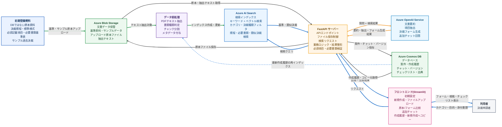
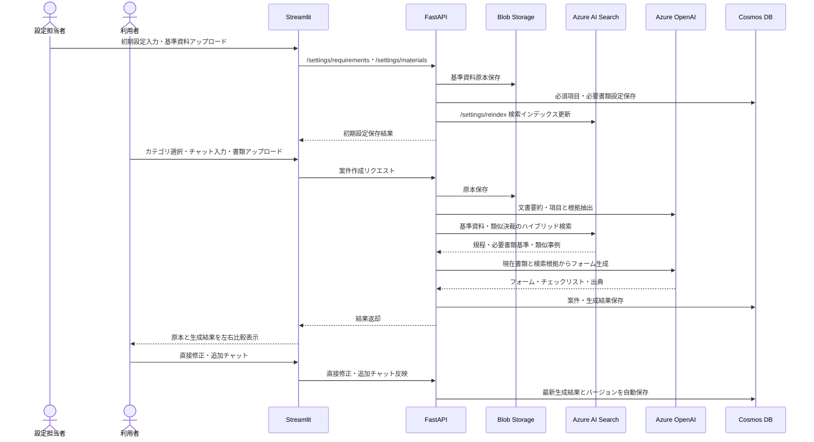
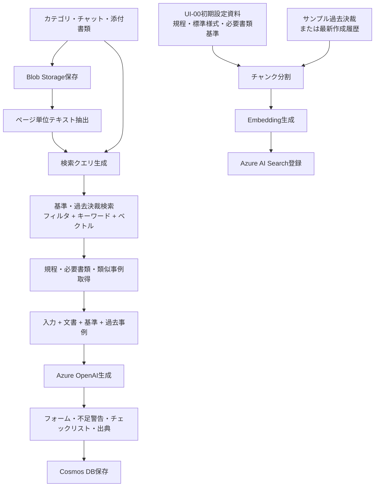
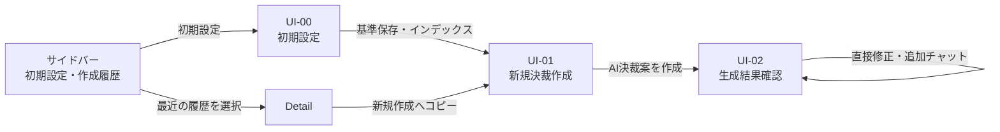
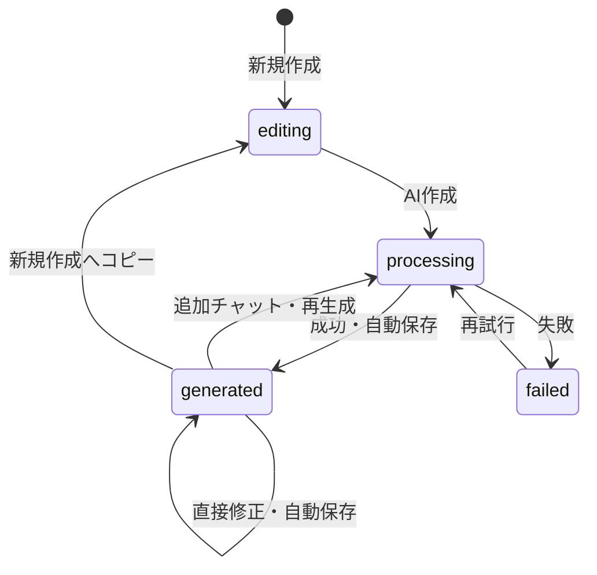

# 生成AIによる決裁書類作成支援Webアプリ 設計書・仕様書

## 1. 企画概要

### 1.1 システム名

**決裁RAGアシスタント**

### 1.2 背景

社内の決裁業務では、請求書、見積書、契約書、稟議資料などを確認し、決裁タイトル、金額、決裁科目番号、記載内容、添付書類、確認事項を手作業で整理する必要がある。

また、過去の類似決裁を探し、どのような内容を記載し、どの書類を添付すべきか確認する作業にも時間がかかる。添付漏れ、金額や日付の転記ミス、サービス期間の記載漏れなどにより、差戻しが発生する可能性もある。

本システムは、利用者が選択した業務カテゴリ、チャット入力、アップロード書類をもとに、Azure OpenAI Service と Azure AI Search を利用したRAGを実行する。決裁規程、標準様式、必要書類基準、過去の類似決裁を参照し、決裁入力フォーム案、要約、不足・注意事項、チェックリストを生成する。

生成後は、画面左側に原本書類または根拠箇所、右側にAIが作成した決裁フォームを表示し、利用者が項目ごとに比較・修正できるようにする。確認済みの結果は、決裁タイトルと決裁番号を含む履歴として保存する。

### 1.3 目的

- 過去の決裁を探して内容を転記する時間を削減する
- 決裁規程、標準様式、過去事例をもとに必要な記載内容と添付書類を案内する
- アップロード書類から取引先、製品・サービス名、金額、数量、契約・利用期間、日付、支払条件などを抽出する
- 入力フォームと添付書類の金額、日付、取引先、期間等の不一致可能性を通知する
- 必須項目と必要書類の不足をチェックリストと警告で表示する
- 決裁フォームに転記しやすい構造化形式で出力する
- 作成結果と参照根拠を履歴として保存し、次回以降に再利用する

### 1.4 想定利用者

- 決裁申請を作成する社員
- 申請内容を確認する管理者・承認者
- 経理、総務、調達、営業、開発・IT部門などの担当者

### 1.5 現在の実装範囲

本課題は1か月間、通常業務と並行して実施するため、実際にデモ可能な最小機能を優先する。

#### 実装する機能

- 業務カテゴリと決裁種類の選択、その他の自由入力
- 作成前の必須記載内容・必要書類案内
- チャット入力とPDF/JPG/PNGアップロード
- Blob Storageへのファイル保存
- 文書要約と主要項目抽出
- Azure AI Searchによる基準資料・類似決裁検索
- 決裁フォーム案、不足警告、チェックリスト生成
- 原本書類と生成結果の左右比較
- 追加チャットによる部分修正・再生成
- AI生成後・直接修正後・追加チャット後の最新内容自動保存
- サイドバーからの作成履歴選択
- 過去フォームと添付ファイルの新規作成へのコピー

#### データ利用原則

- 実業務データや個人情報を含む文書は使用しない
- 研修提供サンプルまたは生成AIで作成した架空データを使用する
- AIの出力は承認結果ではなく、利用者が確認すべき作成案として扱う

### 1.6 用語

- `決裁`: 組織内の承認手続。本システムの対象
- `決済`: 代金支払やカード支払。決裁種類が支払の場合の業務内容
- `案件`: 1回の決裁作成単位
- `類似決裁`: 現在案件の参考となる過去事例
- `コピー`: 過去履歴のフォームと添付ファイルを新しい案件の初期値として利用すること
- `基準資料`: 決裁規程、標準様式、カテゴリ別必須項目・必要書類基準
- `不足`: 基準上必要だが、現在の入力または添付書類から確認できない項目

### 1.7 システムの効果と限界

#### 利用者への効果

1. 過去の作成方法と社内基準を整理し、必要な記載内容と書類を案内する
2. 請求書・見積書・契約書から主要情報を抽出してフォーム案を作成する
3. 原本とフォームの金額、取引先、期間、日付を比較する
4. 不足書類と確認事項をチェックリストと警告で表示する
5. 原本根拠を確認・修正した結果を履歴として保存する

本システムは、**決裁を自動承認するシステムではなく、決裁作成と事前確認を支援するシステム**である。

| 対象 | 期待効果 |
|---|---|
| 申請者 | 作成時間短縮、必要書類の把握、差戻し削減 |
| 確認者・承認者 | 整理されたフォーム案と根拠を同一画面で確認 |
| 管理部門 | 繰り返し発生する不足・誤記の削減、ナレッジ再利用 |

#### 保証しない事項

- AIが規程の最終解釈や承認可否を決定しない
- 添付書類の真正性や取引自体の妥当性を判定しない
- 過去決裁を無条件で正解として扱わない
- 最終判断と修正責任は利用者にある

## 2. システム全体像

### 2.1 利用技術

| 区分 | 採用技術 | 用途 |
|---|---|---|
| フロントエンド | Streamlit | 入力、チャット、ファイルアップロード、結果確認 |
| バックエンド | FastAPI | API、RAG処理、Azure連携、保存 |
| 生成AI | Azure OpenAI Service | 要約、項目抽出、フォーム・チェックリスト生成 |
| 検索/RAG | Azure AI Search | 規程、標準様式、必要書類基準、過去決裁検索 |
| DB | Azure Cosmos DB | 案件、生成バージョン、チャット、履歴 |
| ファイル保存 | Azure Blob Storage | 原本、抽出テキスト、生成成果物 |
| PDF処理 | PyMuPDF等 | ページ単位のテキスト抽出とプレビュー |
| 開発言語 | Python | Streamlit、FastAPI、Azure SDK |

### 2.2 使用予定Azureリソース

| カテゴリ | リソース名 | 方針 |
|---|---|---|
| リソースグループ | `20260526_forPBL` | 使用 |
| Azure OpenAI | `20260526-forPBL-aoai` | Chat、項目抽出、Embedding |
| Azure AI Search | `20260526forpblaisearch2` | 基準資料と過去決裁検索 |
| Blob Storage | `lim` | 原本、抽出テキスト、成果物保存 |
| Cosmos DB | `lim-pbl-decision-cosmos` 候補 | 権限と費用を確認して作成 |

Storage Account名 `lim`は形式条件を満たすが、Azure全体で一意である必要がある。使用済みの場合は`lim`を含む一意な名前に変更する。

Cosmos DBは本システムの作成履歴データベースとして使用する。新規作成権限と費用は実装前に確認する。

### 2.3 RAG知識データ

AI Searchには過去決裁だけでなく、以下を登録する。

| データ種類 | 例 | 役割 | 優先度 |
|---|---|---|---|
| 決裁規程 | 金額別承認基準、必須記載事項 | 必ず守る基準 | 1 |
| 標準様式・作成ガイド | 本文例、項目説明 | フォーム構造・書き方 | 1 |
| 必要書類基準 | 支払時は請求書が必要等 | 不足書類判定 | 1 |
| 承認済み過去決裁 | 類似する購入・支払・契約 | 表現、科目候補、実例 | 2 |
| 本システムの最新作成履歴 | AI生成・修正された最新結果 | 履歴表示と新規作成コピー | 3 |

規程と基準資料を過去事例より優先する。過去事例が規程と異なる場合は、そのまま使用せず「規程との不一致可能性」を表示する。

## 3. システムアーキテクチャ

### 3.1 アーキテクチャ図



#### 色と矢印の意味

| 色 | 対象 | 意味 |
|---|---|---|
| 青 | 利用者・Streamlit・API・AI Search間 | オンラインのリクエスト／レスポンス |
| 黒 | Blob Storage・Cosmos DB・文書処理 | 業務データの保存・取得・内部処理 |
| 緑 | 初期登録資料・Blob Storage・前処理・AI Search | 事前取込・インデックス作成 |
| オレンジ | FastAPIとAzure OpenAI間 | 検索結果を含む質問の送信・AI生成結果の受信 |

RAGにおいて`Azure AI Search`は検索インデックスと関連情報検索を担当する。`Azure OpenAI Service`は検索結果と利用者入力を根拠に、要約、項目抽出、決裁フォーム生成を行う。`FastAPI`は両サービスを呼び出して結果を整形する制御役であるため、アーキテクチャ図では`RAG処理`を別領域として配置しない。

#### 発表資料での推奨レイアウト

```text
上段: [初期登録資料] → [Blob Storage] → [データ前処理] → [Azure AI Search] → [FastAPI] ↔ [Azure OpenAI]
中段: [FastAPI] ↔ [Azure Cosmos DB]
下段: [利用者] ↔ [フロントエンド(Streamlit)] ↔ [FastAPI]
```

`初期登録資料`はデータベースではなく、Blob StorageとAI Searchへ登録する前の原本資料を意味する。実際の案件、作成履歴、チャット、バージョン、チェックリスト、出典を保存するデータベースは`Azure Cosmos DB`の1つとして定義する。

オンライン処理と事前インデックス作成を同じ図で表現するが、発表時には青矢印を「利用時の流れ」、緑矢印を「事前準備の流れ」と説明する。

### 3.2 データフロー



### 3.3 RAG処理



現在アップロードした書類は検索クエリ生成には使うが、直ちにAI Searchへ登録しない。現在文書が自身の検索結果として返ることを防ぐため、基準資料、サンプル過去決裁、利用者が生成・修正した最新作成履歴のみを別途インデックスする。

### 3.4 サービス実行手順

0. 設定担当者が初期設定画面で、カテゴリ別必須項目、必要書類、条件付き書類、標準様式、サンプル過去決裁を登録する
1. システムが初期設定資料をBlob Storageへ保存し、構造化された基準設定をCosmos DBへ保存し、検索対象テキストをAzure AI Searchへインデックスする
2. `営業`、`経理・購買`、`開発・IT`、`その他`からカテゴリを選択する
3. 決裁種類を選択する
4. 初期設定に基づく必須記載内容、必要書類、条件付き書類を確認する
5. 決裁目的を入力し、関連書類をアップロードする
6. `AI決裁案を作成`を押す
7. システムが文書を解析し、基準資料と類似決裁を検索する
8. AIがフォーム、要約、不足警告、チェックリスト、出典を生成する
9. 左側の原本と右側のフォームを比較する
10. フォームを直接修正する、または追加チャットで最新案を更新する
11. AI生成後、直接修正後、追加チャット反映後に最新内容を自動保存する
12. 決裁タイトル、任意入力の決裁番号、最新フォーム、出典、バージョンを履歴として保存する

### 3.5 類似決裁がない場合

新しいサービスなど過去事例がない場合、モデルを再学習するのではなく、次の順序で回答を作成する。

1. 決裁規程、カテゴリ別必須項目、必要書類基準
2. 標準決裁様式、作成ガイド
3. 利用者入力と現在の添付書類から確認できる事実
4. 同カテゴリの一般的な事例
5. モデルの一般知識は文章整理のみに使用する

画面には`直接類似する過去事例なし`と表示する。基準資料もない場合は必要書類を断定せず、`担当部門への確認が必要`と表示する。

## 4. 画面設計

### 4.1 画面一覧

| 画面ID | 画面名 | 主な役割 |
|---|---|---|
| UI-00 | 初期設定 | カテゴリ別入力項目、必要書類、基準資料、標準様式登録 |
| UI-01 | 新規決裁作成 | カテゴリ、チャット、書類、作成前準備事項 |
| UI-02 | AI生成結果確認 | 原本比較、フォーム修正、不足確認、自動保存 |
| UI-03 | 作成履歴 | 履歴選択、詳細確認、新規作成へのコピー |

現在の実装では画面を4つにする。一般利用者の主な流れはUI-01、UI-02、UI-03であり、UI-00は設定担当者が基準資料を登録するために使用する。要約、類似決裁、不足、チェックリスト、修正履歴はUI-02内のタブで表示する。

### 4.2 画面遷移



### 4.3 UI-00 初期設定

初期設定は決裁申請者が毎回行う作業ではなく、設定担当者がシステム利用前に基準を登録する作業である。この設定により、新規作成画面でカテゴリと決裁種類を選択した際に、必須入力項目と必要書類を自動表示できる。

```text
┌──────────────────────┬──────────────────────────────────────────────────────┐
│ 決裁RAG              │ 初期設定                                           │
│ アシスタント         ├──────────────────────────────────────────────────────┤
│                      │ 1. 基準カテゴリ                                    │
│ ⚙ 初期設定           │ 業務カテゴリ [開発・IT ▼]                         │
│ ＋ 新規作成          │ 決裁種類 [支払 ▼]                                  │
│ ▾ 作成履歴           │                                                      │
│                      │ 2. 必須入力項目                                    │
│                      │ [取引先] [製品・サービス名] [金額] [利用期間]      │
│                      │ [+ 入力項目追加]                                   │
│                      │                                                      │
│                      │ 3. 必要書類基準                                    │
│                      │ 必須: [請求書]                                      │
│                      │ 条件付き: [見積書] 条件 [新規契約または基準金額以上]│
│                      │                                                      │
│                      │ 4. 基準資料アップロード                            │
│                      │ [決裁規程PDF] [標準様式PDF] [サンプル過去決裁CSV]  │
│                      │                                                      │
│                      │ [初期設定保存] [検索インデックス更新]              │
└──────────────────────┴──────────────────────────────────────────────────────┘
```

| 設定項目 | 保存先 | 利用目的 |
|---|---|---|
| カテゴリ・決裁種類別必須入力項目 | Cosmos DB | 作成前準備事項とフォーム項目生成 |
| 必要書類・条件付き書類基準 | Cosmos DB | 不足書類検証とチェックリスト生成 |
| 標準様式・作成ガイド原本 | Blob Storage | 原本保管と検索インデックス |
| サンプル過去決裁ファイル | Blob Storage / Cosmos DB | 類似決裁検索と履歴例 |
| 基準資料テキストチャンク | Azure AI Search | RAG検索根拠 |

保存後、FastAPIは基準資料をテキスト抽出し、Azure AI Searchインデックスを更新する。カテゴリ別の構造化設定は`/requirements` APIで取得し、UI-01へ表示する。

### 4.4 カテゴリと動的フォーム

#### カテゴリ

- `営業`
- `経理・購買`
- `開発・IT`
- `その他`

`その他`を選択した場合、カテゴリ名を自由入力する。決裁種類も`購入 / 支払 / 契約 / 出張・イベント / その他`とし、その他の場合は自由入力欄を表示する。

#### 共通入力項目

| 項目 | 入力方法 | 必須 |
|---|---|---|
| 業務カテゴリ | ラジオ | Yes |
| その他カテゴリ名 | テキスト | 条件付き |
| 決裁種類 | セレクト | Yes |
| その他決裁種類 | テキスト | 条件付き |
| 決裁タイトル | テキスト | No。未入力時はAI提案 |
| 目的・背景 | テキストエリア | Yes |
| 希望完了日 | 日付 | No |
| 決裁科目番号 | テキスト | No |
| 添付書類 | ファイル | 基準により条件付き |

#### カテゴリ別追加項目

| カテゴリ | 追加項目 |
|---|---|
| 営業 | 顧客名、案件名、営業目的、実施期間、期待効果 |
| 経理・購買 | 取引先、請求番号、税抜金額、税額、合計、支払期限、勘定科目候補 |
| 開発・IT | プロジェクト・システム名、製品・サービス名、契約・利用期間、ライセンス期間、数量、単価、利用目的、セキュリティ確認 |
| その他 | 相手先、対象製品・サービス、期間、金額、目的 |

### 4.5 共通サイドバー

```text
┌──────────────────────────┐
│ 決裁RAGアシスタント      │
├──────────────────────────┤
│ ⚙ 初期設定               │
│ ＋ 新規作成              │
│ ▾ 作成履歴               │
│   SaaS利用料支払         │
│   タブレット購入         │
│   顧客イベント費用       │
├──────────────────────────┤
│ 現在の作成               │
│ CASE-20260608-001        │
└──────────────────────────┘
```

#### 操作ルール

- `初期設定`でUI-00へ移動する
- `新規作成`でUI-01へ移動する
- `作成履歴`を押すと矢印が開き、最近の履歴をチャット一覧のように表示する
- 最近の履歴は最後にAI生成または修正した時刻順に並べる
- 履歴にはAI生成が一度以上実行された決裁作成セッションを表示する
- 履歴を選択すると、過去チャット、フォーム、添付書類、チェックリストをメイン領域に表示する
- 履歴を選択した後も、フォーム項目はそのまま編集できる
- 画面を最初に開いたときは、最も最近に実行した作成履歴を基本表示する
- UI-02結果確認中は、サイドバーに現在の案件IDだけを表示する
- AI生成、フォーム直接修正、追加チャット反映後に最新結果を自動保存する
- BackendやAzure接続状態は利用者向けサイドバーに表示しない
- 接続エラー時のみ、メイン画面に理解しやすいエラーを表示する

### 4.6 UI-01 新規決裁作成

```text
┌──────────────────────┬──────────────────────────────────────────────────────┐
│ ＋ 新規作成          │ 新規決裁作成                                       │
│ ▾ 作成履歴           │ 1. 業務カテゴリ                                   │
│   SaaS利用料支払     │ (●)営業 ( )経理・購買 ( )開発・IT ( )その他       │
│   タブレット購入     │ [その他: カテゴリ名入力.......................]   │
│                      │                                                      │
│ 現在の作成           │ 2. 決裁種類 [購入 ▼]                               │
│ CASE-...             │ [その他: 決裁種類入力........................]    │
│                      │                                                      │
│                      │ 3. 作成前の準備事項                                │
│                      │ 必須記載: 目的、取引先、サービス、予定金額         │
│                      │ 必要書類: 請求書、見積書                           │
│                      │ 条件付き: 新規取引先の場合は契約書                 │
│                      │                                                      │
│                      │ 4. タイトル・目的・追加情報                        │
│                      │ [目的を入力.................................]      │
│                      │                                                      │
│                      │ 5. 関連書類アップロード                            │
│                      │ [ファイル選択] invoice.pdf                         │
│                      │                         [AI決裁案を作成]            │
└──────────────────────┴──────────────────────────────────────────────────────┘
```

#### 作成前準備事項

- カテゴリと決裁種類の選択直後に基準資料を検索する
- 一般利用者の新規作成画面で決裁案を実行する主ボタンは`AI決裁案を作成`のみにする
- `必須記載内容`、`必要書類`、`条件付き書類`を区別して表示する
- 入力済みは完了、未入力は`入力が必要`と表示する
- 書類不足でもAI案は生成できるが、不足警告を表示する
- 作成前案内と生成後チェックリストは同じ基準資料を使用する

#### 基準資料と過去履歴がない場合

- 共通最小入力として、目的、相手先、製品・サービス、金額または金額未定理由を表示する
- 必要書類は断定せず`担当部門への確認が必要`とする
- `このカテゴリには社内基準と過去事例が登録されていません`と表示する
- AIは現在入力と添付書類だけで案を作り、推測値を自動入力しない

### 4.7 生成処理中

```text
┌──────────────────────┬──────────────────────────────────────────────────────┐
│ ＋ 新規作成          │ AI決裁案を作成しています                          │
│ ▾ 作成履歴           │ [✓] ファイル保存                                  │
│   SaaS利用料支払     │ [✓] 文書内容抽出                                  │
│                      │ [●] 基準・類似事例検索                             │
│ 現在の作成           │ [ ] 不足・不一致確認                              │
│ CASE-...             │ [ ] フォーム・チェックリスト生成                  │
│                      │                                           [中止]   │
└──────────────────────┴──────────────────────────────────────────────────────┘
```

### 4.8 UI-02 AI生成結果確認

```text
┌──────────────────────┬─────────────────────────────┬──────────────────────────┐
│ ＋ 新規作成          │ 原本書類・根拠              │ AI生成決裁フォーム       │
│ ▾ 作成履歴           │ [invoice.pdf ▼] [1/2]      │ タイトル [............]  │
│   SaaS利用料支払     │ ┌─────────────────────────┐ │ 取引先 [..............]  │
│                      │ │ PDF・画像プレビュー     │ │ サービス [............]  │
│ 現在の作成           │ └─────────────────────────┘ │ 期間 [................]  │
│ CASE-...             │ 選択した根拠               │ 金額 [................]  │
│                      │ invoice.pdf / 1ページ      │ 本文 [................]  │
│                      │ 「合計金額 120,000円」     │ 各項目 [根拠を見る]      │
├──────────────────────┴─────────────────────────────┴──────────────────────────┤
│ [要約] [類似決裁] [不足・注意 2] [チェックリスト] [修正履歴]             │
│ ⚠ 見積書を確認できません                   [追加] [該当なし]             │
│ ⚠ サービス利用終了日を確認できません       [直接入力]                   │
│ ✓ 請求金額とフォーム金額が一致しています                                │
├─────────────────────────────────────────────────────────────────────────────┤
│ AIへの修正依頼 [本文を3文以内にしてください.........................]    │
│ 入力後Enterで最新案を更新します。                                      │
│ AI決裁案作成後の修正内容は自動保存されます。                          │
└─────────────────────────────────────────────────────────────────────────────┘
```

#### 原本比較

- 左側にPDF・画像、右側に編集可能なフォームを表示する
- `根拠を見る`で該当ファイルとページへ移動する
- ファイル名、ページ、引用文、出典種類を表示する
- 過去事例の根拠と現在添付書類の根拠を区別する
- 現在の実装範囲では、ページ移動と引用文表示までを行う

#### 追加チャット

- 右側フォームの下または画面下部に固定する
- フォーム項目は常に直接修正できる
- 追加チャットを入力すると、現在フォーム、添付書類、検索根拠を使って最新案を更新する
- 変更前の値を修正履歴として保持する
- AI生成、フォーム直接修正、追加チャット反映後に最新結果を自動保存する
- 作成画面には、別の編集ボタンや保存ボタンは置かない

### 4.9 不足・注意の表示

| 表示 | 意味 | 例 |
|---|---|---|
| エラー | 既存決裁システムへ転記する前に確認が必要 | 必須請求書なし、金額未入力 |
| 注意 | 不一致または根拠が弱い | 請求書と見積書の金額が異なる |
| 要確認 | 資料だけでは判断不能 | サービス終了日、科目番号 |
| 完了 | 基準充足または利用者確認済み | 取引先と金額確認済み |

#### 判定手順

1. カテゴリ・決裁種類から必要書類基準を検索する
2. ファイル名だけでなく文書内容から書類種類を判定する
3. 基準上の必要書類とアップロード書類を比較する
4. 必須フォーム項目と抽出値を比較する
5. 複数書類とフォームの金額、取引先、期間、日付を比較する
6. 不足・不一致ごとに理由と対応方法を表示する

#### 利用者の対応

- `ファイル追加`: 追加後に再検査
- `直接入力`: 不足値をフォームへ入力
- `根拠を見る`: 必要と判断した基準を確認
- `該当なし`: 理由を入力して例外処理
- `担当者確認`: 未確定項目として保存

エラーが残っていても最新作成内容は自動保存される。画面ではエラーと確認事項を表示し続け、利用者が既存決裁システムへ転記する前に確認できるようにする。

#### 類似事例がない場合の表示

```text
┌──────────────────────────────────────────────────────────┐
│ 類似決裁                                                 │
│ ℹ 直接類似する過去決裁は見つかりませんでした。          │
│                                                          │
│ 今回使用した基準                                         │
│ ✓ 開発・IT 支払決裁の必須項目基準                       │
│ ✓ サービス利用料の標準作成様式                           │
│ ✓ 支払決裁の必要書類基準                                 │
│                                                          │
│ ⚠ 科目番号は担当部門への確認が必要です。                │
└──────────────────────────────────────────────────────────┘
```

### 4.10 UI-03 作成履歴

```text
┌──────────────────────┬──────────────────────────────────────────────────────┐
│ ＋ 新規作成          │ 最近の作成履歴: SaaS利用料支払                  │
│ ▾ 作成履歴           │ 最終実行: 2026-06-08 14:20                     │
│ ▶ SaaS利用料支払     ├───────────────────────────┬──────────────────────────┤
│   タブレット購入     │ 最近のチャット・修正内容│ 最新AI生成フォーム       │
│   顧客イベント費用   │ 利用者: クラウド...     │ タイトル [............]  │
│                      │ AI: 決裁案を作成...     │ 取引先 [..............]  │
│                      │ 利用者: 本文を短く...   │ 金額 [................]  │
│                      │                           │ 本文 [................]  │
│                      ├───────────────────────────┴──────────────────────────┤
│                      │ 添付書類・根拠・チェックリスト・修正履歴           │
│                      │ [新規作成へコピー]                                │
└──────────────────────┴──────────────────────────────────────────────────────┘
```

#### 過去案件コピー規則

- UI-03を開くと、最も最近にAI生成を実行した作成履歴を基本表示する
- サイドバーで別の履歴を選ぶと、その履歴の会話、最新フォーム、添付書類、チェックリストを表示する
- 複雑な全件検索テーブルは設けず、ChatGPTの会話一覧のように最近の作成セッションから選択する
- 履歴は最新の自動保存内容を表示し、選択後も編集を続けられる
- 詳細画面の`新規作成へコピー`は、過去履歴をもとに新しい決裁案を作る機能である
- 新しい案件ID、作成日、任意入力の決裁番号を使用する
- 過去カテゴリ、決裁種類、タイトル、本文、入力値、チェックリストを新規作成画面へ自動入力する
- 過去添付書類も新しい案件の添付一覧へ自動コピーする
- 添付書類は原本ファイルを変更せず、Blob Storage上で新しい案件パスへサーバー側コピーする
- コピー済みファイルには`過去履歴からコピー`と表示し、利用者が維持、削除、新ファイルへ交換できるようにする
- 日付、金額、サービス期間、請求書など時点により変わる情報は`再確認が必要`と表示する
- コピー直後はAI結果を確定値として使わず、利用者が新しい書類を基準に再生成するよう案内する
- 元案件IDを`cloned_from_case_id`として保存し、関係を追跡する
- 類似決裁検索結果を見ることと履歴コピーは別機能である

### 4.11 新規作成へコピー

```text
┌──────────────────────┬──────────────────────────────────────────────────────┐
│ ＋ 新規作成          │ AP-2026-001 タブレット購入      最新作成履歴      │
│ ▾ 作成履歴           │ [新規作成へコピー]                                │
│   SaaS利用料支払     ├───────────────────────────┬──────────────────────────┤
│ ▶ タブレット購入     │ 過去チャット・作成フォーム│ 添付書類・参照根拠       │
│   顧客イベント費用   │ 利用者: タブレット購入... │ invoice.pdf              │
│                      │ AI: 決裁案を作成...       │ estimate.pdf             │
│                      │ タイトル、取引先、金額    │ 各ファイル [プレビュー]  │
│                      ├───────────────────────────┴──────────────────────────┤
│                      │ チェックリスト・不足対応・修正履歴                 │
└──────────────────────┴──────────────────────────────────────────────────────┘
```

`新規作成へコピー`を選ぶと確認後にUI-01へ移動する。コピーされた値とファイルには`過去履歴からコピー`バッジを表示する。

### 4.12 主な操作遷移

| 現在画面 | 操作 | 結果 |
|---|---|---|
| UI-01 | AI決裁案を作成 | 生成処理中 |
| 生成処理中 | 成功 | UI-02 |
| UI-02 | ファイル追加 | 再解析して不足一覧更新 |
| UI-02 | フォーム直接修正 | 同じ画面で最新結果を自動保存 |
| UI-02 | 追加チャット入力 | 同じ画面で最新案を更新し自動保存 |
| サイドバー | 履歴選択 | 履歴詳細 |
| 履歴詳細 | 新規作成へコピー | フォーム・添付済みのUI-01 |

### 4.13 自動保存原則

利用者が別の保存ボタンや完了ボタンを押さなくても、主要な実行時点で最新内容を自動保存する。一般利用者の作成フローで明示的に押す主ボタンは`AI決裁案を作成`のみにする。

```text
自動保存のタイミング:
- AI決裁案を作成した後
- フォーム項目を直接修正した後
- 追加チャットで最新案を更新した後
- ファイルを追加・削除して不足一覧を更新した後
```

本システム内では社内決裁の承認状態を管理しない。作成した内容は、利用者が確認後に既存の社内決裁システムへ転記する前提とする。

## 5. 機能仕様

### 5.1 機能一覧

| ID | 機能 | 概要 | 優先度 |
|---|---|---|---|
| F-00 | 初期基準設定 | カテゴリ別必須項目、必要書類、標準様式、サンプル過去決裁を登録する | Must |
| F-01 | カテゴリ選択 | 3基本カテゴリまたはその他 | Must |
| F-02 | 作成前準備事項 | 必須記載・必要書類表示 | Must |
| F-03 | 決裁情報入力 | チャットと動的フォーム | Must |
| F-04 | 書類アップロード・保存 | Blob Storageへ保存 | Must |
| F-05 | 文書抽出 | 取引先、サービス、期間、数量、金額、日付 | Must |
| F-06 | 基準・類似決裁検索 | ハイブリッド検索 | Must |
| F-07 | フォーム案生成 | カテゴリ別フォーム | Must |
| F-08 | 出典連携 | ファイル、ページ、引用文 | Must |
| F-09 | 原本比較 | 原本と生成フォームを左右表示 | Must |
| F-10 | 不足・不一致検出 | 書類、必須項目、値の差 | Must |
| F-11 | チェックリスト | 確認事項と対応状況 | Must |
| F-12 | 直接修正・再生成 | 項目単位または全体 | Must |
| F-13 | 自動保存 | AI生成、直接修正、追加チャット後に最新内容を保存 | Must |
| F-14 | 履歴選択 | サイドバーから最近の作成履歴を選択 | Must |
| F-15 | 履歴コピー | フォームと添付書類をコピー | Must |
| F-16 | エクスポート | Markdown/CSV | Could |

### 5.2 主要ユースケース

#### UC-00 初期基準を設定する

1. 設定担当者がUI-00初期設定画面を開く
2. 業務カテゴリと決裁種類を選択、または新規入力する
3. 必須フォーム入力項目を登録する
4. 必須添付書類と条件付き添付書類を登録する
5. 決裁規程、標準様式、作成ガイド、サンプル過去決裁ファイルをアップロードする
6. FastAPIが原本ファイルをBlob Storageへ保存する
7. FastAPIが構造化された必須項目・必要書類設定をCosmos DBへ保存する
8. FastAPIが基準資料テキストを抽出し、Azure AI Searchインデックスを更新する
9. 以降、利用者がUI-01で同じカテゴリと決裁種類を選択すると、その基準が作成前準備事項として表示される

#### UC-01 新規決裁案

1. カテゴリ・決裁種類を選択する
2. 作成前準備事項を確認する
3. 目的を入力し書類をアップロードする
4. AI決裁案を作成する
5. 基準資料と類似決裁を検索する
6. フォーム・不足・チェックリストを生成する
7. 原本とフォームを比較・修正する
8. 直接修正または追加チャット反映後、最新内容が自動保存される

#### UC-02 類似決裁確認

類似決裁はRAGの参考根拠であり、フォーム全体のコピー機能ではない。類似理由、カテゴリ、決裁種類、科目番号、金額帯を表示し、必要な事例だけを再生成の参考に含める。

#### UC-03 追加チャット

利用者は追加チャット欄に`本文を3文以内にする`等の指示を入力する。変更前後を表示し、適用後に新しいバージョンとして自動保存する。

#### UC-04 過去履歴から新規作成

過去履歴を選び、`新規作成へコピー`を押す。フォームと添付書類を新案件へコピーし、日付、金額、期間、書類を再確認してAI案を再生成する。

#### UC-05 類似事例なし

過去事例がない場合は、規程、標準様式、必要書類基準、現在文書だけで案を作成する。確定できない項目は担当部門確認にする。

### 5.3 類似決裁の検索基準

| 基準 | 内容 | 推奨比率 |
|---|---|---|
| 意味類似度 | タイトル、目的、文書要約 | 50% |
| カテゴリ・決裁種類 | 同一カテゴリ・種類 | 20% |
| 科目番号・勘定科目 | 同一または同系統 | 15% |
| 必要書類・タグ | 請求書、契約書、ライセンス等 | 10% |
| 金額帯 | 近い金額範囲 | 5% |

作成者は基本スコアに含めず、`自分の履歴のみ`のフィルタとして使用する。決裁番号は類似検索ではなく完全一致検索に使う。

### 5.4 Azure AI SearchとRAGの役割

Azure AI Searchは、大量の規程・基準・過去決裁から関連部分だけを取得する。キーワード検索は決裁番号や科目番号、ベクトル検索は自然文の意味類似性に使用し、ハイブリッド検索で統合する。

RAGは検索結果をAzure OpenAIへ渡し、根拠に基づいてフォーム、不足警告、チェックリストを生成する。全データをプロンプトへ入れず、関連結果をTop 3～5に限定してトークンと応答時間を削減する。

### 5.5 不足・誤記の判定

| 比較 | 判定例 |
|---|---|
| 基準表 対 アップロード書類 | 支払決裁なのに請求書なし |
| 必須フォーム 対 抽出値 | サービス期間を確認できない |
| 書類 対 書類・フォーム | 請求書と見積書の金額が異なる |

主な対象は取引先、製品・サービス、契約・利用期間、ライセンス期間、数量、単価、税額、合計、請求日、支払期限、契約番号、科目番号、必要書類である。

AIが抽出できなかった値と、文書に存在しない値を完全に区別できないため、`不足確定`ではなく`文書から確認できません`と表示する。

## 6. API仕様

### 6.1 API一覧

| メソッド | パス | 用途 |
|---|---|---|
| GET | `/health` | FastAPI稼働確認 |
| GET | `/settings/requirements` | 登録済みカテゴリ別基準設定一覧 |
| POST | `/settings/requirements` | 必須入力項目、必要書類、条件付き書類設定保存 |
| POST | `/settings/materials` | 決裁規程、標準様式、サンプル過去決裁アップロード |
| POST | `/settings/reindex` | 初期設定資料をAzure AI Searchへインデックス |
| GET | `/requirements` | 作成前必須項目・必要書類取得 |
| POST | `/cases` | 新規案件・ファイル登録 |
| POST | `/cases/{case_id}/generate` | 抽出、検索、フォーム生成 |
| POST | `/cases/{case_id}/chat` | 追加指示・再生成 |
| GET | `/cases` | 履歴一覧 |
| GET | `/cases/{case_id}` | 案件詳細 |
| PUT | `/cases/{case_id}` | フォーム直接修正の自動保存 |
| POST | `/cases/{case_id}/clone` | フォーム・添付書類コピー |
| GET | `/cases/{case_id}/files/{file_id}` | 添付取得 |

### 6.2 `/health`

StreamlitからFastAPIが稼働しているか確認する開発・運用用APIであり、利用者画面には常時表示しない。

### 6.3 初期設定API

初期設定APIはUI-00で使用する。

`POST /settings/requirements`リクエスト例:

```json
{
  "business_category": "it",
  "approval_type": "支払",
  "required_fields": [
    {"key": "purpose", "label": "目的", "type": "textarea", "required": true},
    {"key": "vendor", "label": "取引先", "type": "text", "required": true},
    {"key": "service_name", "label": "製品・サービス名", "type": "text", "required": true},
    {"key": "amount", "label": "金額", "type": "number", "required": true},
    {"key": "service_period", "label": "利用期間", "type": "date_range", "required": true}
  ],
  "required_documents": ["請求書"],
  "conditional_documents": [
    {"document": "見積書", "condition": "新規契約または基準金額以上"}
  ],
  "form_template": {
    "title_format": "{vendor} {service_name} 支払に関する決裁",
    "body_sections": ["目的", "根拠", "金額", "期間", "添付書類"]
  }
}
```

`POST /settings/materials`は決裁規程、標準様式、作成ガイド、サンプル過去決裁ファイルをアップロードする。FastAPIはファイルをBlob Storageへ保存し、ファイルメタデータをCosmos DBへ保存する。

`POST /settings/reindex`はBlob Storage上の基準資料とサンプル過去決裁をテキスト化し、Azure AI Searchインデックスを更新する。

### 6.4 `/requirements`

例: `/requirements?business_category=it&approval_type=payment`

```json
{
  "source_status": "rule_found",
  "required_fields": ["目的", "取引先", "サービス名", "金額", "利用期間"],
  "required_documents": ["請求書"],
  "conditional_documents": [
    {"document": "見積書", "condition": "新規契約または基準金額以上"}
  ]
}
```

`source_status`:

- `rule_found`: 基準資料あり
- `history_only`: 基準なし、過去事例のみ。参考情報として表示
- `no_reference`: 基準も過去事例もなし。共通最小項目のみ表示

### 6.5 案件作成項目

| 項目 | 型 | 必須 |
|---|---|---|
| `business_category` | string | Yes |
| `business_category_other` | string | 条件付き |
| `approval_type` | string | Yes |
| `approval_type_other` | string | 条件付き |
| `title` | string | No |
| `description` | string | Yes |
| `approval_category_no` | string | No |
| `amount` | number | No |
| `requester_id` | string | Yes |
| `category_fields` | JSON | No |
| `files` | file[] | No。基準により必要 |

### 6.6 `POST /cases/{case_id}/generate` レスポンス

```json
{
  "case_id": "case_20260605_001",
  "business_category": "it",
  "approval_type": "支払",
  "summary": "請求書と見積書に基づくクラウドサービス利用料の決裁申請です。",
  "extracted_fields": {
    "vendor": "ABC株式会社",
    "service_name": "クラウドサービス Standard Plan",
    "amount": 120000,
    "invoice_date": "2026-06-01",
    "service_start_date": "2026-07-01",
    "service_end_date": null,
    "approval_category_no": "IT-001"
  },
  "similar_cases": [
    {
      "case_id": "past_001",
      "title": "クラウド利用料決裁",
      "score": 0.86,
      "reason": "科目番号と申請内容が類似"
    }
  ],
  "checklist": [
    "請求書金額と申請金額が一致することを確認",
    "見積書または契約書が添付されていることを確認",
    "決裁科目番号が過去事例と矛盾しないことを確認"
  ],
  "approval_form": {
    "title": "ABC株式会社クラウド利用料の支払決裁",
    "body": "業務システム運用に必要なクラウド利用料について、添付請求書を根拠に支払決裁を申請します。",
    "amount": 120000,
    "required_documents": ["請求書", "見積書"]
  },
  "field_sources": {
    "amount": [
      {
        "source_type": "uploaded_document",
        "file_id": "file_001",
        "file_name": "invoice.pdf",
        "page": 1,
        "quote": "合計金額 120,000円"
      }
    ]
  },
  "missing_information": [
    "最終的な決裁科目番号の確認が必要です。"
  ],
  "validation_results": [
    {
      "severity": "warning",
      "code": "SERVICE_END_DATE_NOT_FOUND",
      "message": "サービス利用終了日を文書から確認できません。",
      "actions": ["manual_input", "mark_not_applicable"]
    },
    {
      "severity": "error",
      "code": "REQUIRED_DOCUMENT_MISSING",
      "message": "支払決裁に必要な見積書を確認できません。",
      "basis": {
        "source_type": "required_document_rule",
        "source_id": "rule_finance_payment_001"
      },
      "actions": ["upload_file", "mark_exception"]
    }
  ]
}
```

### 6.7 `POST /cases/{case_id}/chat` リクエスト

```json
{
  "instruction": "決裁本文を承認者向けに3文以内へ短縮してください。",
  "target_field": "body",
  "mode": "selected_field",
  "current_version": 1
}
```

`mode`は`selected_field`または`full_regeneration`を使用する。

### 6.8 API処理規則

- AI結果を構造化JSONとして検証する
- Structured Outputs対応モデルではJSON Schemaを使用する
- 非対応時はPydanticで検証し、不正時は再要求する
- 新規作成中は`editing`、生成中は`processing`、生成後は`generated`として内部管理する
- AI生成、直接修正、追加チャット反映後に最新内容を自動保存する
- 必須項目と未解決エラーは生成時と修正時に再検証し、画面上に表示し続ける
- 再生成時は既存バージョンを上書きしない
- コピー時は添付を新しいBlobパスへコピーする

## 7. データ設計

### 7.1 Cosmos DB

現在の実装では物理コンテナを2つにする。

| コンテナ | 保存対象 | パーティションキー |
|---|---|---|
| `decision-data` | 案件、バージョン、チャット、初期基準設定 | `/case_id` または `/config_id` |
| `past-decisions` | RAG用過去決裁 | `/business_category` |

`decision-data`では`document_type`を`case`、`version`、`chat`、`requirement_config`、`material`で区別する。案件文書は`case_id`をパーティションキーにし、初期基準設定文書は`config_id`をパーティションキーにする。

#### `cases`

| 項目 | 型 | 説明 |
|---|---|---|
| `id` / `case_id` | string | 案件ID |
| `document_type` | string | `case` |
| `requester_id` | string | 申請者 |
| `business_category` | string | `sales/finance/it/other` |
| `business_category_other` | string | その他カテゴリ |
| `approval_type` | string | 決裁種類 |
| `approval_type_other` | string | その他種類 |
| `approval_no` | string | 利用者が入力する決裁番号、またはAIが候補として抽出した番号 |
| `title`, `description` | string | タイトル・目的 |
| `status` | string | `editing/processing/generated/failed` |
| `file_ids` | string[] | 添付 |
| `extracted_fields` | object | 抽出結果 |
| `approval_form` | object | フォーム |
| `checklist` | object[] | チェックリスト |
| `validation_results` | object[] | 不足・注意 |
| `field_sources` | object | 項目別出典 |
| `similar_case_ids` | string[] | 参考案件 |
| `cloned_from_case_id` | string | コピー元 |
| `current_version` | number | 現在バージョン |
| `last_generated_at` | string | 最終生成・更新日時 |

#### `chat` / `version`

チャットには役割、メッセージ、対象フィールド、バージョンを保存する。バージョンにはフォーム、出典、修正指示、生成日時を保存する。

#### `requirement_config`

カテゴリと決裁種類ごとの必須入力項目、必要書類、条件付き書類、フォームテンプレートを保存する。

| 項目 | 型 | 説明 |
|---|---|---|
| `id` | string | 設定ID |
| `config_id` | string | パーティションキー |
| `document_type` | string | `requirement_config` |
| `business_category` | string | 業務カテゴリ |
| `approval_type` | string | 決裁種類 |
| `required_fields` | object[] | フォーム必須入力項目定義 |
| `required_documents` | string[] | 必須添付書類 |
| `conditional_documents` | object[] | 条件付き添付書類 |
| `form_template` | object | 件名・本文生成形式 |
| `material_file_ids` | string[] | 紐付く基準資料ファイル |
| `updated_by` | string | 設定担当者 |
| `updated_at` | string | 更新日時 |

### 7.2 Blob Storage

| コンテナ | 用途 | 例 |
|---|---|---|
| `config-materials` | 初期設定基準資料の原本 | `settings/{business_category}/{approval_type}/{file_name}` |
| `uploaded-documents` | 原本 | `cases/{case_id}/original/{file_name}` |
| `extracted-texts` | ページ付き抽出JSON | `cases/{case_id}/text/{file_id}.json` |
| `generated-outputs` | 成果物 | `cases/{case_id}/output/form.md` |

コピー添付には`copied_from_case_id`、`copied_from_file_id`、`requires_reconfirmation`を保存する。コピー側の変更は過去履歴原本へ影響させない。

### 7.3 Azure AI Searchインデックス

インデックス名: `decision-cases-index`

主なフィールド:

| フィールド | 属性・用途 |
|---|---|
| `id` | key |
| `knowledge_type` | policy / template / required_document_rule / past_case |
| `rule_priority` | 規程優先度 |
| `business_category` | filterable/facetable |
| `approval_type` | filterable/facetable |
| `approval_no` | searchable/filterable |
| `requester_id` | 作成者フィルタ |
| `title`, `content` | searchable |
| `approval_category_no` | searchable/filterable |
| `amount` | filterable/sortable |
| `required_documents` | filterable |
| `file_name`, `page` | 出典表示 |
| `content_vector` | vector |

### 7.4 根拠連携

1. PDFをページ単位で抽出する
2. ページ番号付きでチャンク化する
3. AIに`file_id`, `page`, `quote`を返させる
4. FastAPIで引用が抽出テキストに存在するか検証する
5. 検証済み出典のみ画面表示する

現在の実装では、JPG/PNGはプレビューのみとし、テキスト抽出対象をテキストPDFへ限定する。

### 7.5 状態



| 状態 | 意味 |
|---|---|
| `editing` | 入力とファイルを準備中の状態 |
| `processing` | 文書分析、検索、生成を実行している状態 |
| `generated` | AI案の生成後、利用者が修正・根拠確認を行う状態。最新内容は自動保存される |
| `failed` | アップロード、検索、生成中にエラーが発生した状態 |

### 7.6 自動保存と履歴

| タイミング | 内部状態 | 検証 | 修正 |
|---|---|---|---|
| 新規入力中 | `editing` | 作成前準備事項を表示 | 可 |
| AI決裁案作成 | `processing` → `generated` | 不足・注意を計算 | 可 |
| フォーム直接修正 | `generated` | 不足・注意を再計算 | 可 |
| 追加チャット反映 | `processing` → `generated` | 不足・注意を再計算 | 可 |

#### 自動保存処理

1. AI生成、直接修正、追加チャット反映ごとに現在フォーム、チャット、チェックリスト、添付書類、根拠を保存する
2. 未解決エラーが残る場合も保存するが、画面上にはエラーと確認事項を表示し続ける
3. 決裁番号は利用者入力またはAI抽出候補として保持し、本システムでは自動確定しない
4. 履歴画面には最終更新された内容を表示する
5. 新しい案件として再利用する場合は`新規作成へコピー`を使用する

本システムは既存の社内決裁システムの承認状態を管理しない。出力は申請者が転記・確認するための作成支援結果である。

## 8. AI処理仕様

### 8.1 プロンプト方針

- 書類にない事実を断定しない
- 金額、日付、取引先、期間、科目番号に根拠を付ける
- 過去事例と現在案件の相違を明示する
- 過去の金額・取引先・日付を現在事実としてコピーしない
- 規程・必要書類基準を過去事例より優先する
- 不明項目を一般知識で補完しない
- 不足情報を確認事項として列挙する
- 各抽出値に信頼度と出典を付ける

### 8.2 出力形式

```json
{
  "business_category": "finance",
  "approval_type": "支払",
  "document_summary": "添付文書の要約",
  "extracted_fields": {
    "vendor": {
      "value": "取引先",
      "confidence": 0.95
    },
    "service_name": {
      "value": "製品・サービス名",
      "confidence": 0.92
    },
    "amount": {
      "value": 0,
      "confidence": 0.98
    },
    "invoice_date": {
      "value": "YYYY-MM-DD",
      "confidence": 0.9
    },
    "service_period": {
      "start_date": "YYYY-MM-DD",
      "end_date": null,
      "confidence": 0.7
    }
  },
  "similar_case_analysis": [
    {
      "title": "過去決裁タイトル",
      "similarity_reason": "類似理由",
      "useful_points": ["参考点"]
    }
  ],
  "checklist": [
    {
      "task": "確認タスク",
      "priority": "high",
      "reason": "確認が必要な理由"
    }
  ],
  "approval_form": {
    "title": "決裁件名",
    "body": "決裁本文",
    "amount": 0,
    "required_documents": ["請求書"]
  },
  "field_sources": {
    "amount": [
      {
        "source_type": "uploaded_document",
        "file_id": "file_001",
        "file_name": "invoice.pdf",
        "page": 1,
        "quote": "合計金額 120,000円"
      }
    ]
  },
  "validation_results": [
    {
      "severity": "warning",
      "field": "service_period.end_date",
      "message": "サービス終了日を文書から確認できません。"
    }
  ],
  "missing_information": ["不足情報"]
}
```

### 8.3 適用規則

- 出典がない値は`要確認`にする
- 利用者が直接修正した値を再生成時に保護する
- 選択フィールド修正時に他フィールドを変更しない
- チェック完了はAIではなく利用者が行う
- 必須書類・空欄検査は可能な限りPython規則ロジックで行う
- AIは書類分類、値抽出、類似根拠要約、説明文生成に使う

## 9. 非機能要件

| 分類 | 要件 |
|---|---|
| セキュリティ | APIキーをコードへ直接記載せず環境変数で管理 |
| データ | 実業務データを使わない |
| ログ | 原文・チャットをコンソールへ出力しない |
| コスト | 提供AI Searchを優先し不要リソースを削除 |
| 性能 | 類似結果Top 3～5 |
| 監査性 | 出典、参考案件、修正バージョンを保存 |
| 信頼性 | 出典なしは要確認 |
| 利便性 | 初期必須入力を最小化 |

### 9.1 実装制限

| 項目 | 制限 |
|---|---|
| ファイル | PDF/JPG/PNG |
| ファイル数 | 案件ごとに最大5件 |
| サイズ | 1ファイル10MB推奨 |
| PDF | 20ページ推奨 |
| 検索結果 | 最大5件 |
| カテゴリ | 3基本カテゴリ + その他 |
| 同時利用 | デモは1名 |

### 9.2 サンプルデータ

- 3基本カテゴリごとに最低10件、合計30件
- カテゴリごとの必要書類基準を最低1件
- 規程または標準様式を最低3件
- 架空会社・架空案件を使用する

### 9.3 設計上の重要事項

- 必須項目・必要書類はAIではなく担当部門が管理する基準に基づく
- 過去決裁に誤りや古い様式が含まれる可能性を考慮する
- 初期入力を増やしすぎず、抽出後に不足だけを確認させる
- 不足の誤検知・見逃しがあるため`文書から確認できません`と表現する
- 実運用では部門・機密区分による検索権限が必要
- 本システムは既存決裁システムを置き換えず、転記前の支援ツールとする

### 9.4 効果測定

| 指標 | 例 |
|---|---|
| 作成時間 | 手作業とAI支援の比較 |
| 修正回数 | AI生成後に修正したフィールド数 |
| 不足検出 | 意図的な不足の検出率 |
| 根拠表示 | 主要項目に出典がある割合 |
| 利用者負担 | 初期必須入力数 |

### 9.5 推奨成功基準

- サンプル決裁3件で、手作業より初稿作成時間が短くなる
- 意図的に不足させた書類と必須項目をチェックリストへ表示できる
- 金額、取引先、サービス名、期間のうち3項目以上に出典を表示できる
- 類似事例がない場合も、規程と標準様式を使って初稿を生成できる
- 利用者が警告に対して、ファイル追加、直接入力、例外理由のいずれかで対応できる

## 10. エラー処理

| 状況 | 対応 |
|---|---|
| アップロード失敗 | 再アップロードを案内 |
| 非対応ファイル | PDF/JPG/PNGのみと表示 |
| 抽出失敗 | プレビュー維持、手入力を案内 |
| Azure OpenAI失敗 | 現在フォームを維持し再試行 |
| 類似決裁なし | 基準資料と現在文書で作成 |
| 基準資料もなし | 担当部門確認が必要と表示 |
| Cosmos保存失敗 | 画面維持、保存失敗警告 |
| 出典検証失敗 | 根拠確認が必要と表示 |

## 11. 実装方針

### 11.1 ディレクトリ案

```text
workspace/
  streamlit/
    app.py
    components/
      case_form.py
      document_preview.py
      chat_panel.py
      result_tabs.py
      history_sidebar.py
  fastapi/
    app/
      main.py
      routers/
        cases.py
        requirements.py
        chat.py
      services/
        rag_service.py
        validation_service.py
        document_service.py
        search_service.py
        cosmos_service.py
        blob_service.py
```

### 11.2 開発手順

1. 3基本カテゴリとその他の共通・追加項目、基準資料、サンプル決裁形式を確定する
2. StreamlitでUI-00初期設定画面を作る
3. FastAPIで`/settings/requirements`、`/settings/materials`、`/settings/reindex`を実装する
4. 初期設定資料をBlob StorageとCosmos DBへ保存し、Azure AI Searchインデックスを更新する
5. StreamlitでUI-01新規作成画面を作る
6. FastAPIで`/health`、`/cases`、`/generate` APIを作る
7. Blob Storage `lim`へ利用者アップロードファイルを保存し、原本プレビューを表示する
8. PDFページ単位のテキスト抽出と出典データ形式を実装する
9. Azure OpenAIで文書要約と項目抽出を実装する
10. Azure AI Searchハイブリッド検索とRAGプロンプトを実装する
11. UI-02へ原本と結果の左右比較、追加修正チャットを実装する
12. Cosmos DBへ案件、バージョン、チャット、出典を保存する
13. UI-03の履歴表示とコピー機能を実装する
14. デモシナリオとエラーケースをテストする

### 11.3 4週間の推奨計画

| 週 | 目標 |
|---|---|
| 1週目 | 画面、基準資料、サンプル、モックAPI |
| 2週目 | Blob、PDF抽出、Azure OpenAI項目抽出 |
| 3週目 | AI Search、RAG、不足検査、左右比較 |
| 4週目 | 履歴・コピー、追加チャット、テスト、発表 |

## 12. デモシナリオ

### 12.1 開発・IT支払

1. `開発・IT`、`支払`を選択する
2. 作成前の必須項目・必要書類を確認する
3. クラウドサービス利用料と入力する
4. 架空の請求書・見積書をアップロードする
5. AI決裁案を作成する
6. 取引先、サービス名、金額、期間を抽出する
7. 基準と類似決裁を検索する
8. 原本とフォームを比較する
9. 終了日不足を直接入力する
10. チャットで本文を3文以内に修正する
11. 最新内容が自動保存され、作成履歴に表示される

### 12.2 過去履歴再利用

1. サイドバーの作成履歴を開く
2. `SaaS利用料支払`を選択する
3. 過去チャット、フォーム、添付書類を確認する
4. `新規作成へコピー`を押す
5. フォームと添付書類が新案件へコピーされる
6. 金額、請求日、利用期間、添付に`再確認が必要`と表示される
7. 新しい請求書へ交換して再生成する
8. 最新内容が自動保存され、履歴に反映される

### 12.3 期待成果物

- 決裁件名案
- 決裁本文案
- 金額、取引先、日付等の抽出結果
- 類似決裁一覧
- 必要タスクのチェックリスト
- 添付書類確認リスト
- 不足情報・確認事項
- 項目別のファイル名、ページ、引用文
- 修正前後のバージョン
- 決裁タイトルと任意入力した決裁番号を含む保存履歴

## 13. 実装完了基準

- 設定担当者が初期設定画面でカテゴリ別必須入力項目と必要書類基準を登録できる
- 初期設定資料をBlob Storage、Cosmos DB、Azure AI Searchへ用途別に保存・反映できる
- 3基本カテゴリまたはその他を選択できる
- 作成前準備事項を表示できる
- PDFをBlob Storageへ保存できる
- 取引先、サービス、期間、金額、日付のうち3項目以上を抽出できる
- 基準資料と類似決裁を検索できる
- フォーム、不足警告、チェックリストを生成できる
- ファイル名、ページ、引用文を確認できる
- 追加チャットで修正できる
- AI生成、直接修正、追加チャット後に最新内容を自動保存できる
- 履歴からフォームと添付書類をコピーできる
- 類似事例がなくても基準資料で作成できる

## 14. 設計決定まとめ

| 項目 | 決定 |
|---|---|
| 全体フロー | 初期設定 → カテゴリ → 準備事項 → 入力・書類 → AI生成 → 比較 → 修正 → 最新結果を自動保存 |
| サイドバー | 初期設定、新規作成、折りたたみ式履歴 |
| カテゴリ | 営業、経理・購買、開発・IT、その他 |
| RAG知識 | 規程・標準様式・必要書類を優先、過去事例は補助 |
| 類似事例なし | 基準資料と現在文書で作成 |
| 作成前案内 | 必須記載・必要書類・条件付き書類 |
| 初期設定保存 | 構造化基準設定はCosmos DB、原本資料はBlob Storage、検索用テキストはAzure AI Searchへ保存 |
| 根拠 | ファイル、ページ、引用文 |
| 保存方式 | AI生成・直接修正・追加チャット後に自動保存 |
| 承認状態 | 既存の社内決裁システム側で管理 |
| 履歴コピー | フォームと添付をコピーし、時点依存項目を再確認 |

## 15. 実装前に確認する事項

1. 決裁規程、標準様式、必要書類基準のサンプルを入手できるか
2. 初期設定画面で管理するカテゴリ・決裁種類の組み合わせは何か
3. 実際の決裁フォームの共通必須項目は何か
4. 3基本カテゴリが対象組織に適しているか
5. 決裁番号を利用者が入力するか、AI抽出候補として扱うか
6. Azure OpenAIのChat・Embeddingデプロイ名
7. Cosmos DB作成権限と予算

## 16. 発表用まとめ

本システムは、決裁規程、必要書類基準、標準様式、過去の類似決裁をRAGで検索し、アップロード書類から取引先、製品・サービス、期間、金額等を抽出して、決裁フォーム案、不足警告、チェックリストを生成する業務支援アプリケーションである。設定担当者は最初に決裁規程、標準様式、必要書類基準、カテゴリ別入力項目を初期設定として登録する。

利用者は原本書類と生成結果を同一画面で比較し、追加チャットで修正できる。作成結果は履歴として保存され、過去フォームと添付書類を新しい案件へコピーして再利用できる。

## 17. 参考資料

- [Azure AI Search ハイブリッド検索](https://learn.microsoft.com/en-us/azure/search/hybrid-search-how-to-query)
- [Azure AI Search ベクトル検索フィルター](https://learn.microsoft.com/en-us/azure/search/vector-search-filters)
- [Azure OpenAI Structured Outputs](https://learn.microsoft.com/en-us/azure/ai-services/openai/how-to/structured-outputs)
- [Azure Storage Account作成](https://learn.microsoft.com/en-us/azure/storage/common/storage-account-create)
- [Azure Cosmos DB Free Tier](https://learn.microsoft.com/en-us/azure/cosmos-db/free-tier)
