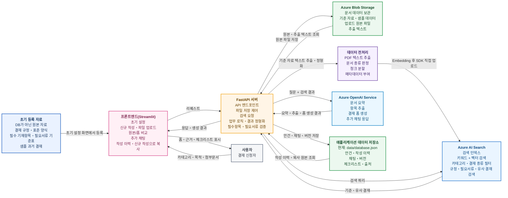
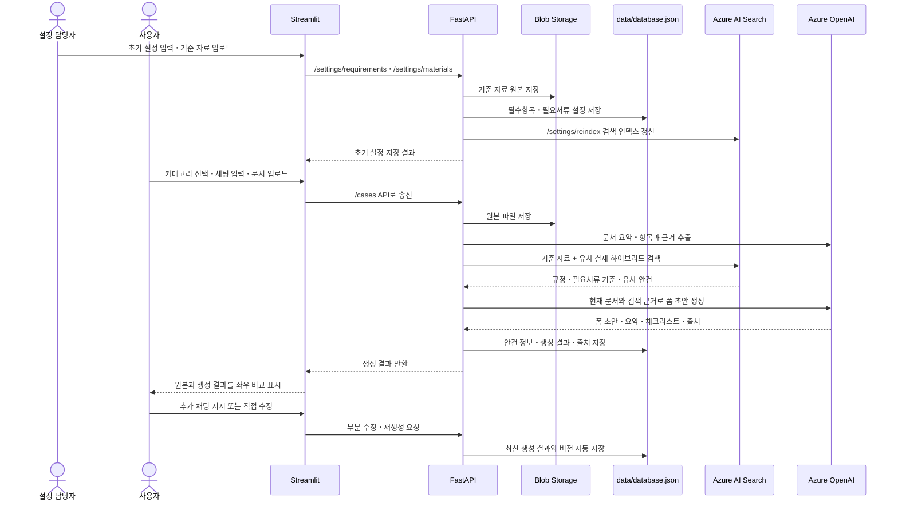
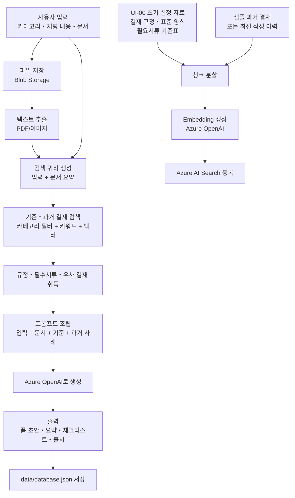
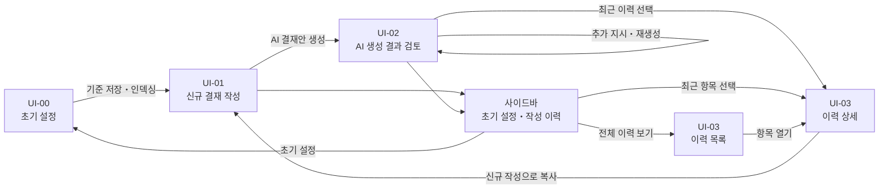
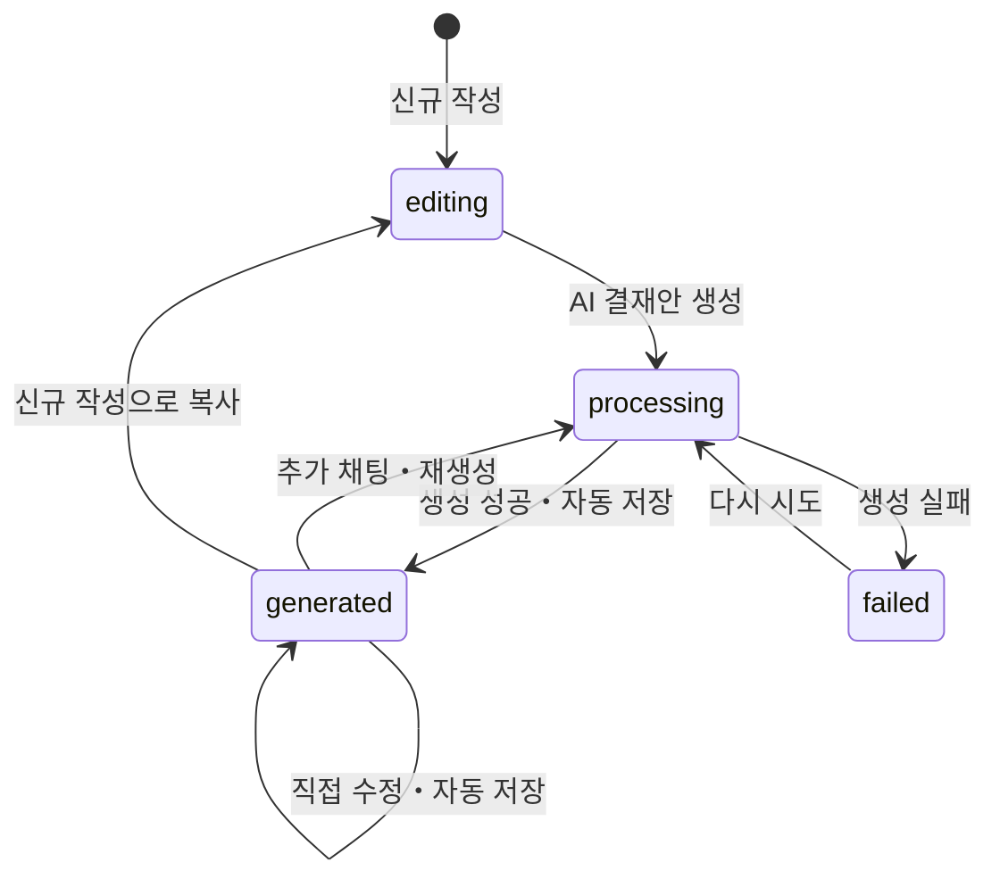

# 생성AI 기반 결재 서류 작성 지원 Web 애플리케이션 설계서・사양서

## 1. 기획 개요

### 1.1 시스템명

**결재 RAG 어시스턴트**

### 1.2 배경

사내 결재 업무에서는 청구서, 견적서, 계약서, 품의서 등 여러 문서를 확인하고 결재 제목, 금액, 결재과목번호, 기재 내용, 첨부서류, 확인 태스크를 수작업으로 정리해야 한다.

또한 과거의 유사 결재 사례를 참고하여 작성 수준, 필요한 첨부서류, 결재과목번호 등을 확인하는 데에도 시간이 많이 소요된다.

본 시스템은 사용자가 선택한 결재 업무 카테고리, 채팅 입력, 업로드 문서를 바탕으로 Azure OpenAI Service와 Azure AI Search 기반 RAG를 수행한다. 과거의 유사 결재 사례와 현재 첨부문서의 근거를 함께 참조하여 결재 입력 폼 초안, 요약, 체크리스트를 자동 생성한다.

생성 후에는 화면 왼쪽에 원본 문서 또는 근거 부분을 표시하고, 오른쪽에 AI가 작성한 결재 폼을 표시하여 사용자가 항목별 근거를 비교하고 수정할 수 있게 한다. 최신 생성・수정 결과는 결재 제목과 선택 입력한 결재번호를 포함한 이력으로 자동 저장한다.

### 1.3 목적

- 사용자가 과거 결재를 직접 찾아보고 내용을 복사하는 시간을 줄인다
- 결재 규정, 표준 양식, 과거 승인 사례를 바탕으로 어떤 내용을 쓰고 어떤 서류를 첨부해야 하는지 안내한다
- 청구서 등 업로드 문서에서 거래처, 서비스・제품명, 금액, 계약・이용 기간, 수량, 날짜, 지급 조건 등을 추출한다
- 입력 폼과 첨부문서 사이의 금액, 날짜, 거래처 등 불일치 가능성을 알려준다
- 필수항목과 필요서류의 누락을 체크리스트와 경고로 표시한다
- 결재 입력 폼에 옮겨 적기 쉬운 형식으로 결과를 출력한다
- 생성 결과와 참조한 과거 사례를 저장하여 다음 검색과 작성에 재활용한다

### 1.4 예상 이용자

- 결재 신청을 작성하는 직원
- 신청 내용을 확인하는 관리자와 승인자
- 경리, 총무, 조달 등 결재 관련 문서를 다루는 담당자

### 1.5 현재 구현 범위와 전제

본 과제는 한 달 동안 업무와 병행하여 구현하므로 전체 기능을 한 번에 완성하는 것보다, 실제 시연 가능한 최소 기능을 우선한다.

#### 구현할 범위

- 결재 카테고리 선택과 `기타` 직접 입력
- 채팅 입력과 PDF/JPG/PNG 파일 업로드
- 업로드 파일의 Blob Storage 저장
- 문서 요약과 주요 항목 추출
- Azure AI Search를 이용한 기준 자료와 과거 유사 결재 검색
- 결재 폼 초안과 체크리스트 생성
- 누락 서류, 미확인 항목, 문서 간 불일치 경고
- 원본 문서 근거와 생성 결과의 좌우 비교
- 추가 채팅 지시에 따른 부분 수정 또는 재생성
- 결재 제목과 선택 입력한 결재번호를 포함한 이력 자동 저장
- 사이드바에서 과거 작성 이력 선택
- 과거 폼과 첨부문서를 신규 작성으로 복사

#### 데이터 사용 원칙

- 실제 업무 데이터와 개인정보가 포함된 문서는 사용하지 않는다
- 연수에서 제공된 샘플 또는 생성AI로 만든 가상 데이터를 사용한다
- AI 결과는 결재 완료 결과가 아니라 사용자가 확인해야 하는 초안으로 취급한다

### 1.6 용어 정의

- `결재`: 조직 내 승인 절차를 의미한다. 본 시스템의 대상이다
- `결제`: 대금 지급이나 카드 지불을 의미한다. 결재 종류가 지급인 경우에만 업무 내용으로 등장한다
- `안건`: 한 번의 결재 작성 단위를 의미한다
- `유사 결재`: 현재 안건 작성에 참고할 수 있는 과거 사례다
- `복제`: 과거 이력의 폼을 초깃값으로 사용하여 새로운 안건을 작성하는 기능이다
- `기준 자료`: 결재 규정, 표준 양식, 카테고리별 필수항목・필요서류 기준표를 의미한다
- `누락`: 기준 자료상 필요하지만 현재 입력이나 첨부문서에서 확인되지 않은 항목을 의미한다

### 1.7 시스템의 효용과 한계

#### 사용자에게 제공하는 효용

1. 과거 결재 작성방식과 사내 기준을 AI가 정리하여 현재 결재에 필요한 기재항목과 첨부서류를 안내한다
2. 업로드한 청구서・견적서・계약서에서 주요 값을 추출하여 결재 폼 초안을 자동 작성한다
3. 원본 문서와 생성 폼의 금액, 거래처, 기간, 날짜가 일치하는지 비교한다
4. 부족한 서류와 확인이 필요한 내용을 체크리스트와 경고로 표시한다
5. 사용자가 원본 근거를 확인하고 수정한 최종 결과를 이력으로 남긴다

따라서 본 시스템은 **결재를 자동 승인하는 시스템이 아니라, 결재 작성과 사전 점검을 지원하는 시스템**이다.

#### 기대 효과

| 대상 | 기대 효과 |
|---|---|
| 신청자 | 작성시간 단축, 필요한 서류 파악, 재작업 감소 |
| 확인자・승인자 | 형식이 정리된 초안과 근거를 한 화면에서 확인 |
| 관리부서 | 반복되는 누락과 오류 감소, 과거 사례의 재사용 |

#### 시스템이 보장하지 않는 사항

- AI가 결재 규정의 최종 해석이나 승인 여부를 결정하지 않는다
- 첨부문서가 진본인지, 거래 자체가 타당한지는 판정하지 않는다
- 과거 결재가 잘못 작성되어 있어도 자동으로 정답으로 취급하지 않는다
- 금액과 날짜의 불일치는 경고할 수 있지만 최종 판단과 수정 책임은 사용자에게 있다

## 2. 시스템 전체 개요

### 2.1 사용 기술

| 구분 | 채택 기술 | 용도 |
|---|---|---|
| 프론트엔드 | Streamlit | 채팅 UI, 파일 업로드, 결과 확인 화면 |
| 백엔드 | FastAPI | API, RAG 처리, Azure 연동, 데이터 저장 |
| 생성AI | Azure OpenAI Service | 요약, 항목 추출, 체크리스트 생성, 폼 생성 |
| 검색/RAG | Azure AI Search | 결재 규정, 표준 양식, 필수서류 기준, 과거 결재의 검색 |
| 애플리케이션 데이터 | 로컬 JSON (`data/database.json`) | 결재 안건, 설정, 기준 자료 메타데이터, 생성 이력 |
| 파일 저장 | Azure Blob Storage | 업로드 문서, 추출 텍스트, 생성 결과물 |
| 문서 추출 | pypdf / pypdfium2 | 페이지별 텍스트 추출과 PDF 이미지 미리보기 |
| 개발 언어 | Python | Streamlit, FastAPI, Azure SDK |

### 2.2 사용 예정 Azure 리소스

| 카테고리 | 리소스명 | 사용 여부・방침 |
|---|---|---|
| 리소스 그룹 | `20260526_forPBL` | 사용 |
| Azure OpenAI | `20260526-forPBL-aoai` | 채팅, 요약, 항목 추출, Embedding 생성 |
| Azure AI Search | 서비스 `20260526forpblaisearch2` / 인덱스 `lim-rag` | 기준 자료와 과거 결재 검색 |
| Blob Storage | Storage Account `20260526forpbl2850763855` | 원본, 추출 텍스트, 생성 결과 저장 |
| Cosmos DB | 현재 비활성 (`AZURE_COSMOS_ENABLED=false`) | 현재 이력과 설정은 `data/database.json`에 저장 |

현재 Azure 설정은 OpenAI, AI Search, Blob Storage를 사용하고 Cosmos DB만 로컬 JSON으로 대체한다.
키와 연결 문자열은 `.env`에만 저장하며 사양서와 Git에는 기록하지 않는다.

### 2.3 RAG 지식 데이터 구성

AI Search에 저장할 지식은 과거 결재만으로 구성하지 않는다.

| 데이터 종류 | 예 | 역할 | 우선순위 |
|---|---|---|---|
| 결재 규정 | 금액별 승인 기준, 필수 기재사항 | 반드시 지켜야 할 기준 | 1 |
| 표준 양식・작성 가이드 | 결재 본문 예시, 항목 설명 | 폼 구조와 작성 방식 | 1 |
| 필요서류 기준표 | 지급은 청구서 필요, 계약은 계약서 필요 | 누락 서류 판정 | 1 |
| 승인된 과거 결재 | 유사 구매・지급・계약 사례 | 표현, 과목번호 후보, 실제 패턴 참고 | 2 |
| 사용자 작성 이력 | 본 시스템에서 생성・수정한 최신 결과 | 작성 이력 조회와 신규 작성 복사 | 3 |

규정과 기준 자료는 과거 결재보다 우선한다. 과거 사례가 규정과 다를 경우 과거 사례를 그대로 따르지 않고 `규정과 불일치 가능성`을 표시한다.

## 3. 시스템 아키텍처

### 3.1 아키텍처도



#### 색상과 화살표 의미

| 색상 | 대상 | 의미 |
|---|---|---|
| 파란색 | 사용자・Streamlit・API・AI Search 사이 | 온라인 요청・응답 |
| 검은색 | Blob Storage・로컬 JSON 데이터 저장소・문서 처리 | 업무 데이터 저장・조회・내부 처리 |
| 녹색 | 초기 등록 자료・Blob Storage・전처리・AI Search | 사전 수집・인덱스 생성 |
| 주황색 | FastAPI와 Azure OpenAI 사이 | 검색 결과를 포함한 질문 전달・AI 생성 결과 수신 |

RAG에서 `Azure AI Search`는 이미 등록된 기준 자료와 과거 결재의 검색을 담당한다. `Azure OpenAI Service`는
검색 결과와 사용자 입력, 현재 첨부문서의 추출 텍스트를 근거로 요약과 결재 폼 생성을 수행한다.
`FastAPI`는 문서 추출, 검색 지식 JSON의 Blob 동기화, 검색과 생성 호출을 제어한다.
Azure 모드의 기본 구성은 Blob Data source, Text Split/Azure OpenAI Embedding Skillset,
Indexer를 사용하는 integrated vectorization 방식이다.

#### 발표 자료 권장 레이아웃

```text
상단: [초기 등록 자료] → [Streamlit] → [FastAPI] → [Blob Storage / 데이터 전처리] → [Azure AI Search]
중단: [FastAPI] ↔ [Azure OpenAI], [FastAPI] ↔ [data/database.json]
하단: [사용자] ↔ [프론트엔드(Streamlit)] ↔ [FastAPI]
```

`초기 등록 자료`는 데이터베이스가 아니라 Blob Storage와 AI Search에 넣기 전의 원본 자료를 의미한다.
현재 실행 설정에서 실제 안건, 작성 이력, 채팅, 버전, 체크리스트, 출처는 `data/database.json`에 저장한다.

한 그림에 온라인 처리와 사전 인덱스 생성을 함께 표시한다. 발표 시 파란 화살표는 `서비스 이용 시 흐름`, 녹색 화살표는 `사전 데이터 준비 흐름`으로 설명한다.

### 3.2 데이터 흐름도



### 3.3 RAG 처리 상세



현재 업로드 문서는 생성 과정에서 검색 질의를 만드는 데 사용하지만 즉시 AI Search 인덱스에 등록하지 않는다. 현재 문서가 자기 자신의 검색 결과로 반환되는 것을 방지하기 위해, 기준 자료, 샘플 과거 결재, 사용자가 생성・수정한 최신 작성 이력만 별도 인덱싱한다.

### 3.4 확정한 서비스 실행 순서

0. 설정 담당자가 초기 설정 화면에서 카테고리별 필수 입력항목, 필요서류, 조건부 서류, 표준 양식, 샘플 과거 결재를 등록한다
1. 시스템이 초기 설정 자료를 Blob Storage에 저장하고, 구조화된 기준 설정은 `data/database.json`에 저장하며, 검색 대상 텍스트는 Azure AI Search에 직접 인덱싱한다
2. 사용자가 초기 화면에서 `영업`, `경리・구매`, `개발・IT`, `기타` 중 업무 카테고리를 선택한다
3. 선택한 카테고리에 맞는 입력항목과 필요서류가 표시된다
4. 사용자가 채팅란에 결재 목적과 보충 설명을 입력하고 관련 문서를 업로드한다
5. 사용자가 `AI 결재안 생성` 버튼을 누른다
6. 시스템이 문서에서 정보를 추출하고 결재 기준 자료와 과거 유사 결재를 검색한다
7. AI가 필수항목・필요서류와 현재 입력을 비교하고, 결재 폼 초안, 요약, 체크리스트, 항목별 출처를 생성한다
8. 검토 화면에서 왼쪽은 원본 문서, 오른쪽은 생성된 폼을 표시한다
9. 사용자가 폼을 직접 수정하거나 하단 채팅란에 수정 지시를 입력한다
10. 사용자가 폼을 직접 수정하거나 추가 요청을 입력하면 최신 결과가 자동 저장된다
11. 시스템이 결재 제목, 최신 폼, 참조 출처, 수정 버전을 이력으로 저장한다

### 3.5 과거 유사 결재가 없는 경우

새로운 서비스나 처음 발생한 결재는 과거 사례가 없을 수 있다. 이 경우 시스템은 학습을 새로 수행하지 않고 다음 우선순위로 답변을 생성한다.

1. 결재 규정과 카테고리별 필수항목・필요서류 기준표
2. 표준 결재 양식과 작성 가이드
3. 사용자가 입력한 목적과 현재 첨부문서의 사실
4. 같은 카테고리의 일반적인 결재 사례
5. 모델의 일반지식은 문장 정리에만 사용하고 사실・사내 규칙 생성에는 사용하지 않는다

과거 유사 결재가 없으면 화면에 `직접 유사한 과거 사례 없음`을 표시하고, AI가 규정・기준 자료만으로 초안을 작성했음을 알려준다. 기준 자료도 없으면 필수항목을 확정하지 않고 `담당부서 확인 필요`로 표시한다.

## 4. 화면 설계

### 4.1 화면 목록

| 화면ID | 화면명 | 주요 역할 |
|---|---|---|
| UI-00 | 초기 설정 | 카테고리별 입력항목, 필요서류, 기준 자료, 표준 양식 등록 |
| UI-01 | 신규 결재 작성 | 카테고리 선택, 채팅 입력, 문서 업로드, 생성 시작 |
| UI-02 | AI 생성 결과 검토 | 원본과 생성 폼 비교, 체크리스트, 추가 채팅 수정, 저장 |
| UI-03 | 결재 이력 | 저장된 안건 검색, 상세 확인, 과거 안건 복제 |

현재 구현에서는 화면을 4개로 구성한다. 일반 결재 신청자의 주요 흐름은 UI-01, UI-02, UI-03이며,
UI-00은 설정 담당자가 기준 자료를 등록할 때 사용한다. UI-02의 `요약` 영역에는 생성 요약,
문서 간 기재내용 비교표, 누락·주의, 체크리스트, 필요서류를 연속해서 표시한다.
유사 결재와 수정 이력은 일반 사용자가 필요할 때만 여는 `상세정보` 확장 영역에 표시한다.

### 4.2 화면 전이도



### 4.3 UI-00 초기 설정 화면

초기 설정은 결재 신청자가 매번 수행하는 작업이 아니라, 설정 담당자가 시스템 사용 전에 기준을 등록하는 작업이다. 이 설정이 있어야 신규 작성 화면에서 카테고리와 결재 종류를 선택했을 때 필수 입력항목과 필요서류를 자동으로 표시할 수 있다.

```text
┌──────────────────────┬──────────────────────────────────────────────────────┐
│ 결재 RAG             │ 초기 설정                                           │
│ 어시스턴트           ├──────────────────────────────────────────────────────┤
│                      │ 1. 기준 카테고리                                    │
│ ⚙ 초기 설정          │ 업무 카테고리 [개발・IT ▼]                         │
│ ＋ 신규 작성         │ 결재 종류 [지급 ▼]                                  │
│ ▾ 작성 이력          │                                                      │
│                      │ 2. 필수 입력항목                                    │
│                      │ [거래처] [제품・서비스명] [금액] [서비스 기간]      │
│                      │ [+ 입력항목 추가]                                   │
│                      │                                                      │
│                      │ 3. 필요서류 기준                                    │
│                      │ 필수: [청구서]                                      │
│                      │ 조건부: [견적서] 조건 [신규 계약 또는 기준 금액 이상]│
│                      │                                                      │
│                      │ 4. 기준 자료 업로드                                 │
│                      │ [결재 규정 PDF] [표준 양식 PDF] [샘플 과거 결재 CSV] │
│                      │                                                      │
│                      │ [초기 설정 저장] [검색 인덱스 갱신]                 │
└──────────────────────┴──────────────────────────────────────────────────────┘
```

초기 설정에서 저장하는 내용은 다음과 같다.

| 설정 항목 | 저장 위치 | 사용 목적 |
|---|---|---|
| 카테고리・결재 종류별 필수 입력항목 | `data/database.json` | 작성 전 준비사항과 폼 항목 생성 |
| 필요서류・조건부 서류 기준 | `data/database.json` | 누락 서류 검증과 체크리스트 생성 |
| 표준 양식・작성 가이드 원본 | Blob Storage | 원본 보관과 검색 인덱싱 |
| 샘플 과거 결재 파일 | Blob Storage / `data/database.json` | 유사 결재 검색과 이력 예시 |
| 기준 자료 텍스트 청크 | Azure AI Search | RAG 검색 근거 |

저장 후 FastAPI는 기준 자료를 텍스트로 추출하고 Azure AI Search 인덱스를 갱신한다. 카테고리별 구조화 설정은 `/requirements` API에서 조회되어 UI-01에 표시된다.

### 4.4 카테고리와 동적 입력 폼

#### 카테고리 선택 방식

- 카테고리는 화면 상단의 라디오 버튼으로 하나만 선택한다
- 선택값은 `영업`, `경리・구매`, `개발・IT`, `기타`로 한다
- `기타`를 선택하면 `카테고리 직접 입력` 필드를 표시한다
- 카테고리를 바꾸면 공통 입력항목 아래의 추가 입력항목만 변경된다
- 카테고리는 부서명이 아니라 결재 내용의 업무 성격을 기준으로 선택한다
- 어느 카테고리인지 불분명한 경우 `경리・구매`를 기본값으로 사용하지 않고 사용자가 직접 선택하게 한다
- 결재 종류에서 `기타`를 선택하면 `결재 종류 직접 입력` 필드를 표시한다

#### 공통 입력항목

| 항목 | 입력 방식 | 필수 | 비고 |
|---|---|---|---|
| 업무 카테고리 | 라디오 | Yes | 영업 / 경리・구매 / 개발・IT / 기타 |
| 카테고리 직접 입력 | 텍스트 | 조건부 | 카테고리가 기타일 때 필수 |
| 결재 종류 | 셀렉트박스 | Yes | 구매 / 지급 / 계약 / 출장・행사 / 기타 |
| 결재 종류 직접 입력 | 텍스트 | 조건부 | 결재 종류가 기타일 때 필수 |
| 결재 제목 | 텍스트 | No | 비어 있으면 AI가 제안 |
| 결재 목적・배경 | 채팅형 텍스트 영역 | Yes | 자연어로 입력 |
| 희망 완료일 | 날짜 | No | 필요할 때만 입력 |
| 결재과목번호 | 텍스트 | No | 알고 있을 때 입력, 없으면 AI가 후보 제시 |
| 첨부문서 | 파일 업로드 | 조건부 | 기준에 따라 필요. PDF/JPG/PNG |

#### 카테고리별 추가 입력항목

| 카테고리 | 추가 입력항목 |
|---|---|
| 영업 | 고객명, 관련 프로젝트・안건명, 영업 목적, 실시 기간, 기대 효과 |
| 경리・구매 | 거래처, 청구번호, 공급가액, 세액, 합계금액, 지급기한, 계정과목 후보 |
| 개발・IT | 프로젝트・시스템명, 제품・서비스명, 계약・서비스 기간, 라이선스 기간, 수량, 단가, 이용 목적, 보안 검토 여부 |
| 기타 | 직접 입력한 카테고리명, 상대방・거래처, 대상 제품・서비스, 기간, 금액, 목적 |

> 모든 항목을 처음부터 필수로 입력시키면 AI 자동 추출의 의미가 줄어든다. 사용자는 최소한의 목적 설명과 문서만 입력하고, 문서에서 추출하지 못한 항목만 검토 화면에서 보완하도록 한다.

### 4.5 공통 사이드바와 화면 이동

모든 화면의 왼쪽에는 같은 사이드바를 표시한다.

```text
┌──────────────────────────┐
│ 결재 RAG 어시스턴트      │
├──────────────────────────┤
│ ⚙ 초기 설정              │
│ ＋ 신규 작성             │
│ ▾ 작성 이력              │
│   SaaS 이용료 지급       │
│   태블릿 구매            │
│   고객 행사 비용         │
├──────────────────────────┤
│ 현재 작성                │
│ CASE-20260608-001        │
└──────────────────────────┘
```

#### 사이드바 조작 규칙

- `신규 작성`을 누르면 UI-01로 이동한다
- `초기 설정`을 누르면 UI-00으로 이동한다
- `작성 이력`을 누르면 화살표가 펼쳐지며 최근 작성 이력을 채팅 목록처럼 표시한다
- 최근 이력은 마지막 실행・수정 시각 기준으로 정렬한다
- 이력에는 AI 생성이 한 번 이상 실행된 결재 작성 세션을 표시한다
- 이력 항목을 누르면 메인 영역에 해당 안건의 과거 채팅, 작성 폼, 첨부문서, 체크리스트를 표시한다
- 이력 항목은 선택 후 계속 편집할 수 있다
- 화면을 처음 열면 가장 최근에 실행한 작성 이력을 기본으로 표시한다
- UI-02 결과 검토 중에는 사이드바에 현재 초안번호만 표시한다
- 사용자가 AI 생성을 실행하거나 수정 지시를 적용하면 최신 결과를 자동 저장한다
- 화면 상태는 Streamlit `session_state` 또는 임시 안건 ID로 유지한다
- Backend와 Azure 서비스 연결 상태는 사용자 사이드바에 표시하지 않는다
- 연결 오류가 발생한 경우에만 메인 화면에 사용자가 이해할 수 있는 오류 메시지를 표시한다

### 4.6 UI-01 신규 결재 작성 화면

```text
┌──────────────────────┬──────────────────────────────────────────────────────┐
│ 결재 RAG             │ 신규 결재 작성                                     │
│ 어시스턴트           ├──────────────────────────────────────────────────────┤
│                      │ 1. 업무 카테고리                                    │
│ ＋ 신규 작성         │ (●) 영업 ( ) 경리・구매 ( ) 개발・IT ( ) 기타      │
│ ▾ 작성 이력          │ [기타 선택 시: 카테고리 직접 입력..............]   │
│   SaaS 이용료 지급   │                                                      │
│   태블릿 구매        │ 2. 결재 종류 [구매 ▼]                               │
│   고객 행사 비용     │ [기타 선택 시: 결재 종류 직접 입력.............]   │
│                      │                                                      │
│ 현재 작성            │ 3. 작성 전 준비사항                                │
│ CASE-...             │ 필수 기재: 목적, 거래처, 대상 서비스, 예상 금액    │
│                      │ 필요서류: 청구서, 견적서                            │
│                      │ 조건부: 신규 거래처인 경우 계약서                  │
│                      │                                                      │
│                      │ 4. 결재 제목 [선택 입력........................]    │
│                      │                                                      │
│                      │ 5. 결재 목적과 필요한 내용                          │
│                      │ ┌──────────────────────────────────────────────────┐ │
│                      │ │ 예: 고객 설명회용 태블릿을 구매하려고 합니다. │ │
│                      │ └──────────────────────────────────────────────────┘ │
│                      │                                                      │
│                      │ 6. 카테고리별 추가정보                              │
│                      │ 고객명 [......] 서비스 기간 [......] 금액 [......] │
│                      │                                                      │
│                      │ 7. 관련 문서 업로드                                 │
│                      │ [파일 선택] invoice.pdf  estimate.pdf              │
│                      │                                                      │
│                      │                         [AI 결재안 생성]            │
└──────────────────────┴──────────────────────────────────────────────────────┘
```

#### 조작 규칙

- 카테고리와 결재 종류를 선택하면 시스템이 기준 자료를 검색하여 `작성 전 준비사항`을 표시한다
- 일반 사용자의 신규 작성 화면에서 결재안을 실행하는 주 버튼은 `AI 결재안 생성` 하나만 둔다
- 준비사항에는 `필수 기재내용`, `필요서류`, `조건부 서류`를 구분하여 표시한다
- 현재 입력이 충족한 항목은 완료 표시하고, 아직 입력하지 않은 항목은 `입력 필요`로 표시한다
- `AI 결재안 생성`은 카테고리, 결재 종류, 목적 설명이 입력되면 활성화한다
- 필요서류가 아직 없어도 생성은 가능하지만 버튼 위에 누락 경고를 표시한다
- 생성 중에는 `문서 분석 → 유사 결재 검색 → 폼 생성` 진행 상태를 표시한다
- 파일별 업로드 성공 여부와 삭제 버튼을 제공한다

#### 작성 전 필수사항 표시와 생성 후 체크리스트의 관계

- 작성 전 준비사항은 사용자가 무엇을 준비해야 하는지 미리 알려주는 안내다
- 생성 후 체크리스트는 실제 입력과 업로드 문서를 기준에 대조한 검사 결과다
- 동일한 기준 자료를 사용하므로 작성 전 안내와 생성 후 체크리스트가 연결된다
- 예를 들어 작성 전에는 `견적서 필요`라고 안내하고, 생성 후 견적서가 없으면 `견적서가 확인되지 않음` 경고로 전환한다

#### 기준 자료와 과거 이력이 모두 없는 경우

- 공통 최소 입력인 `결재 목적`, `상대방 또는 거래처`, `대상 제품・서비스`, `금액 또는 금액 미정 사유`를 표시한다
- 필요서류는 확정하지 않고 `담당부서 확인 필요`로 표시한다
- 화면 상단에 `이 카테고리에 등록된 사내 기준과 과거 사례가 없습니다`라는 안내를 표시한다
- AI는 현재 입력과 첨부문서만으로 초안을 생성하고, 추측한 항목은 자동 기입하지 않는다

### 4.7 UI-01 생성 처리 중 화면

```text
┌──────────────────────┬──────────────────────────────────────────────────────┐
│ ＋ 신규 작성         │ AI 결재안을 생성하고 있습니다                     │
│ ▾ 작성 이력          │                                                      │
│   SaaS 이용료 지급   │ [✓] 파일 저장                                       │
│   태블릿 구매        │ [✓] 문서 내용 추출                                 │
│ 현재 초안            │ [●] 결재 기준・유사 사례 검색                      │
│ CASE-...             │ [ ] 누락・불일치 확인                               │
│                      │ [ ] 결재 폼과 체크리스트 생성                      │
│                      │ 업로드 파일: invoice.pdf, estimate.pdf              │
│                      │                                         [취소]      │
└──────────────────────┴──────────────────────────────────────────────────────┘
```

생성 중 오류가 발생하면 완료된 단계는 유지하고 실패 단계와 다시 시도 버튼을 표시한다.

### 4.8 UI-02 AI 생성 결과 검토 화면

```text
┌──────────────────────┬─────────────────────────────┬──────────────────────────┐
│ ＋ 신규 작성         │ 원본 문서・근거             │ AI 생성 결재 폼          │
│ ▾ 작성 이력          │ [invoice.pdf ▼] [1/2]      │ 제목 [...............]   │
│   SaaS 이용료 지급   │ ┌─────────────────────────┐ │ 거래처 [.............]   │
│   태블릿 구매        │ │ PDF・이미지 미리보기    │ │ 서비스 [.............]   │
│ 현재 초안            │ │                         │ │ 기간 [...............]   │
│ CASE-...             │ └─────────────────────────┘ │ 금액 [...............]   │
│                      │ [원본 PDF 새 탭에서 열기]  │ 본문 [...............]   │
│                      │                             │ [폼 내용 복사]           │
├──────────────────────┴─────────────────────────────┴──────────────────────────┤
│ 요약                                                                     │
│ 생성 내용                                                               │
│ 서류 간 기재내용 비교: 항목 | 폼 값 | 서류 | 서류 값 | 일치 여부        │
│ 누락・주의: ⚠ 견적서가 확인되지 않았습니다                               │
│ 체크리스트: □ 要確認: 견적서를 업로드してください                        │
│ 필요서류: 청구서, 견적서                                                 │
│ [상세정보 ▾] 유사 결재・수정 이력                                       │
├─────────────────────────────────────────────────────────────────────────────┤
│ AI 수정 요청                                                              │
│ [본문을 승인자용으로 3문장 이내로 줄여 주세요.........................]   │
│ 입력 후 Enter를 누르면 최신안이 갱신됩니다.                              │
│ AI 결재안 생성 이후의 수정 내용은 자동 저장됩니다.                      │
└─────────────────────────────────────────────────────────────────────────────┘
```

#### 원본과 생성 결과 비교 방식

- 왼쪽에는 업로드한 PDF 또는 이미지를 표시한다
- 오른쪽에는 사용자가 직접 수정 가능한 생성 폼을 표시한다
- `서류 간 기재내용 비교` 표에서 폼 값과 각 문서의 거래처, 서비스명, 금액, 이용 기간을 비교한다
- 비교 결과는 `일치`, `기재 없음`, `차이 있음`, `폼 미입력`으로 표시한다
- 복수 문서의 값이 다르면 백엔드가 AI 응답과 별도로 경고를 생성한다
- 과거 결재와 수정 이력은 `상세정보`를 열었을 때만 표시한다

#### 근거 표시 수준

- 구현 범위: 파일명, 페이지 번호, 관련 원문 인용
- PDF 화면은 해당 페이지로 이동하는 수준까지 구현한다
- 좌표 기반 영역 하이라이트와 이미지 잘라보기는 구현 범위에 포함하지 않는다

#### 추가 수정 채팅의 위치와 동작

- 추가 채팅 입력란은 UI-02의 오른쪽 폼 아래 또는 화면 하단에 고정한다
- 폼 항목은 항상 직접 수정할 수 있다
- 추가 채팅을 입력하면 현재 폼과 첨부문서, 검색 근거를 사용하여 최신안을 갱신한다
- AI 수정 전 값은 삭제하지 않고 수정 이력으로 보관한다
- AI 생성, 폼 직접 수정, 추가 채팅 반영 후 최신 결과를 자동 저장한다
- 작성 화면에는 별도의 편집 버튼이나 저장 버튼을 두지 않는다

### 4.9 누락・주의 알림 방식

#### 알림 분류

| 표시 | 의미 | 예 |
|---|---|---|
| `오류` | 제출 전 반드시 확인해야 함 | 필수 청구서 없음, 금액 미입력 |
| `주의` | 불일치 또는 근거가 약함 | 청구서와 견적서 금액이 다름 |
| `확인 필요` | 자료만으로 판단 불가 | 서비스 종료일, 과목번호 |
| `완료` | 기준 충족 또는 사용자가 확인함 | 거래처와 금액 확인 완료 |

#### 누락 판정 절차

1. 카테고리와 결재 종류를 기준으로 필요서류 기준표를 검색한다
2. 업로드 파일명만 보지 않고 문서 내용에서 서류 종류를 판정한다
3. 기준상 필요한 서류와 실제 업로드 문서를 비교한다
4. 폼의 필수항목과 문서 추출값을 비교한다
5. 복수 문서의 금액, 거래처, 기간, 날짜가 서로 다른지 확인한다
6. 누락・불일치마다 이유와 해결 버튼을 표시한다

#### 사용자 조치

- `파일 추가`: UI-02에서 추가 파일을 업로드하고 누락 검사를 다시 실행한다
- `직접 입력`: 빠진 값을 폼에 입력한다
- `근거 보기`: 어떤 기준 자료 때문에 필요한지 확인한다
- `해당 없음`: 사용자가 사유를 입력하고 경고를 예외 처리한다
- `담당자 확인`: 지금 확정하지 못한 항목으로 표시하여 저장한다

오류가 남아 있어도 최신 작성 내용은 자동 저장된다. 화면은 오류와 확인 필요 항목을 계속 표시하여 사용자가 기존 결재 시스템에 옮겨 적기 전에 확인할 수 있게 한다.

#### 유사 사례가 없는 경우의 표시

```text
┌──────────────────────────────────────────────────────────────────────┐
│ 유사 결재                                                           │
│ ℹ 직접 유사한 과거 결재를 찾지 못했습니다.                         │
│                                                                      │
│ 이번 초안에 사용한 기준                                             │
│ ✓ 개발・IT 지급 결재 필수항목 기준                                  │
│ ✓ 서비스 이용료 표준 작성 양식                                      │
│ ✓ 지급 결재 필요서류 기준                                           │
│                                                                      │
│ 확인 필요                                                           │
│ ⚠ 과거 사례로 확인할 수 없는 과목번호는 담당부서 확인이 필요합니다.│
└──────────────────────────────────────────────────────────────────────┘
```

### 4.10 UI-03 작성 이력 화면

```text
┌──────────────────────┬──────────────────────────────────────────────────────┐
│ ＋ 신규 작성         │ 최근 작성 이력: SaaS 이용료 지급                  │
│ ▾ 작성 이력          │ 마지막 실행: 2026-06-08 14:20                     │
│ ▶ SaaS 이용료 지급   ├────────────────────────────┬─────────────────────────┤
│   태블릿 구매        │ 최근 채팅・수정 내용       │ 최신 AI 생성 폼          │
│   고객 행사 비용     │ 사용자: 클라우드 서비스... │ 제목 [...............]   │
│                      │ AI: 결재 초안을 생성...    │ 거래처 [.............]   │
│                      │ 사용자: 본문을 짧게...     │ 금액 [...............]   │
│                      │                            │ 본문 [...............]   │
│                      ├────────────────────────────┴─────────────────────────┤
│                      │ 첨부문서・근거・체크리스트・수정 이력               │
│                      │ [신규 작성으로 복사]                                │
└──────────────────────┴──────────────────────────────────────────────────────┘
```

#### 과거 안건 복제 규칙

- UI-03을 열면 가장 최근에 AI 생성을 실행한 작성 이력을 기본으로 표시한다
- 사이드바에서 다른 이력 항목을 선택하면 해당 이력의 대화, 최신 폼, 첨부문서, 체크리스트를 표시한다
- 별도의 복잡한 전체 검색 테이블은 두지 않고, ChatGPT 대화 목록처럼 최근 작성 세션 목록으로 접근한다
- 이력은 최신 자동 저장 내용을 표시하며, 선택 후 계속 수정할 수 있다
- 상세 화면의 `신규 작성으로 복사`는 과거 이력을 바탕으로 새로운 결재를 작성하는 기능이다
- 새 결재번호, 작성일, 상태는 새로 생성한다
- 과거 카테고리, 결재 종류, 제목, 본문, 입력값, 체크리스트를 신규 작성 화면에 자동 입력한다
- 과거 첨부문서도 새 안건의 첨부 목록에 자동 복사한다
- 첨부문서는 원본 파일을 변경하지 않고 Blob Storage에서 새 안건 경로로 서버 측 복사한다
- 복사된 파일에는 `이전 이력에서 복사됨`을 표시하고 사용자가 유지, 삭제, 새 파일로 교체할 수 있게 한다
- 날짜, 금액, 서비스 기간, 청구서처럼 시점에 따라 달라지는 정보는 `재확인 필요`로 표시한다
- 복사 직후에는 AI 결과를 확정값으로 사용하지 않고 사용자가 새 문서를 기준으로 다시 생성하도록 안내한다
- 원본 이력 ID는 `cloned_from_case_id`로 저장하여 관계를 추적한다
- 유사 결재 검색 결과를 보는 것과 이력 복제는 서로 다른 기능이다

### 4.11 신규 작성으로 복사

```text
┌──────────────────────┬──────────────────────────────────────────────────────┐
│ ＋ 신규 작성         │ AP-2026-001 태블릿 구매        최신 작성 이력      │
│ ▾ 작성 이력          │ [신규 작성으로 복사]                              │
│   SaaS 이용료 지급   ├────────────────────────────┬─────────────────────────┤
│ ▶ 태블릿 구매        │ 과거 채팅・작성 폼         │ 첨부문서・참조 근거      │
│   고객 행사 비용     │ 사용자: 태블릿 구매...    │ invoice.pdf             │
│                      │ AI: 결재 초안을...         │ estimate.pdf            │
│                      │ 제목, 거래처, 금액, 본문   │ 각 파일 [미리보기]      │
│                      ├────────────────────────────┴─────────────────────────┤
│                      │ 체크리스트・누락 처리・수정 이력                    │
└──────────────────────┴──────────────────────────────────────────────────────┘
```

`신규 작성으로 복사`를 누르면 확인 창을 표시한 뒤 UI-01로 이동한다. 복사된 값과 파일에는 `이전 이력에서 복사됨` 배지를 표시한다.

### 4.12 주요 조작별 화면 전이

| 현재 화면 | 사용자 조작 | 다음 상태・화면 |
|---|---|---|
| UI-01 | AI 결재안 생성 | 생성 처리 중 화면 |
| 생성 처리 중 | 성공 | UI-02 결과 검토 |
| 생성 처리 중 | 실패 | 실패 단계와 다시 시도 표시 |
| UI-02 | 파일 추가 | 같은 화면에서 재분석 후 누락 목록 갱신 |
| UI-02 | 폼 직접 수정 | 같은 화면에서 최신 결과 자동 저장 |
| UI-02 | 추가 채팅 입력 | 같은 화면에서 최신 결과 갱신 및 자동 저장 |
| 사이드바 이력 | 과거 항목 선택 | UI-03 이력 상세 |
| UI-03 상세 | 신규 작성으로 복사 | 폼과 첨부파일이 복사된 UI-01 |
| 모든 화면 | 사이드바 신규 작성 | UI-01 |
| 모든 화면 | 사이드바 작성 이력 펼치기 | 사이드바에 최근 이력 표시 |

### 4.13 자동 저장 원칙

사용자가 별도의 저장 버튼이나 완료 버튼을 누르지 않아도, 주요 실행 시점마다 최신 내용을 자동 저장한다. 일반 사용자의 작성 흐름에서 명시적으로 누르는 핵심 실행 버튼은 `AI 결재안 생성` 하나로 한다.

```text
자동 저장 시점:
- AI 결재안 생성 실행 후
- 폼 항목 직접 수정 후
- 추가 채팅으로 최신안이 갱신된 후
- 파일 추가・삭제 후
```

이력 화면은 항상 가장 최근에 자동 저장된 내용을 표시한다. 화면에는 복잡한 상태 배지를 두지 않고, 필요할 때만 `저장 중`, `자동 저장됨`, `저장 실패`와 같은 짧은 시스템 메시지를 표시한다.

## 5. 기능 사양

### 5.1 기능 목록

| 기능ID | 기능명 | 개요 | 우선도 |
|---|---|---|---|
| F-00 | 초기 기준 설정 | 카테고리별 필수 입력항목, 필요서류, 표준 양식, 샘플 과거 결재를 등록한다 | Must |
| F-01 | 카테고리 선택 | 영업, 경리・구매, 개발・IT, 기타 중 하나를 선택한다 | Must |
| F-02 | 결재 정보 입력 | 채팅형 설명과 카테고리별 추가정보를 입력한다 | Must |
| F-03 | 문서 업로드 | 청구서, 견적서, 계약서 등을 업로드한다 | Must |
| F-04 | 파일 저장 | 업로드 파일을 Blob Storage에 저장한다 | Must |
| F-05 | 문서 요약・항목 추출 | 거래처, 제품・서비스, 기간, 수량, 단가, 금액, 날짜 등을 추출한다 | Must |
| F-06 | 기준・유사 결재 검색 | 카테고리 필터와 하이브리드 검색으로 규정과 과거 사례를 찾는다 | Must |
| F-07 | 결재 폼 초안 생성 | 선택 카테고리에 맞는 폼 초안을 생성한다 | Must |
| F-08 | 출처 연결 | 생성 필드마다 파일명, 페이지, 인용문을 연결한다 | Must |
| F-09 | 원본・결과 비교 | 원본 문서와 생성 폼을 좌우로 표시한다 | Must |
| F-10 | 누락・불일치 감지 | 필요서류, 필수항목, 문서 간 값 차이를 찾는다 | Must |
| F-11 | 체크리스트 생성 | 필요서류, 확인사항, 작업 태스크를 생성한다 | Must |
| F-12 | 직접 수정・채팅 재생성 | 필드를 직접 수정하거나 추가 지시로 재생성한다 | Must |
| F-13 | 자동 저장 | AI 생성, 직접 수정, 추가 채팅 후 최신 내용을 자동 저장한다 | Must |
| F-14 | 최근 이력 표시 | 최근 실행한 작성 세션을 ChatGPT 대화 목록처럼 표시한다 | Must |
| F-15 | 과거 이력 복제 | 과거 폼과 첨부문서를 복사하여 새 결재를 작성한다 | Must |
| F-16 | 결과 내보내기 | 생성 결과를 Markdown/CSV 등으로 출력한다 | Could |

### 5.2 주요 유스케이스

#### UC-00 초기 기준을 설정한다

1. 설정 담당자가 UI-00 초기 설정 화면을 연다
2. 업무 카테고리와 결재 종류를 선택하거나 새 조합을 입력한다
3. 해당 조합에서 반드시 필요한 폼 입력항목을 등록한다
4. 필수 첨부서류와 조건부 첨부서류를 등록한다
5. 결재 규정, 표준 양식, 작성 가이드, 샘플 과거 결재 파일을 업로드한다
6. FastAPI가 원본 파일을 Blob Storage에 저장한다
7. FastAPI가 구조화된 필수항목・필요서류 설정을 `data/database.json`에 저장한다
8. FastAPI가 기준 자료 텍스트를 추출하고 Azure AI Search 인덱스를 갱신한다
9. 이후 사용자가 UI-01에서 같은 카테고리와 결재 종류를 선택하면 해당 기준이 작성 전 준비사항으로 표시된다

#### UC-01 신규 결재 초안을 작성한다

1. 사용자가 업무 카테고리와 결재 종류를 선택한다
2. 사용자가 결재 목적을 채팅형 입력란에 작성한다
3. 사용자가 청구서・견적서 등 관련 문서를 업로드한다
4. 사용자가 `AI 결재안 생성` 버튼을 누른다
5. FastAPI가 파일을 Blob Storage에 저장한다
6. AI가 문서를 요약하고 금액・거래처・날짜 등을 출처와 함께 추출한다
7. Azure AI Search가 동일 또는 관련 카테고리의 과거 유사 결재를 검색한다
8. Azure OpenAI가 현재 문서와 과거 사례를 참고하여 결재 폼 초안과 체크리스트를 생성한다
9. 화면 왼쪽에 원본 문서, 오른쪽에 생성 폼을 표시한다
10. 사용자가 근거를 확인하고 폼을 직접 수정하거나 채팅으로 재생성을 요청한다
11. 사용자가 체크리스트를 확인하고 필요한 항목을 직접 수정한다
12. 수정된 최신 내용은 자동 저장되어 작성 이력에 표시된다

#### UC-02 유사 결재를 확인한다

1. 사용자가 생성 결과 화면의 `상세정보` 확장 영역을 연다
2. 시스템이 유사도순으로 과거 안건을 표시한다
3. 각 결과에는 유사 이유, 카테고리, 결재 종류, 과목번호, 금액대, 검색 점수를 표시한다
4. 사용자가 참조할 안건을 선택한다
5. 사용자가 안건 제목, 과목번호, 금액, 필요서류, 본문을 확인한다
6. 필요한 경우 `선택한 사례를 폼 작성에 참고`를 눌러 AI 재생성에 포함한다

> UC-02는 과거 폼 전체를 그대로 복제하는 기능이 아니다. 유사 결재는 RAG의 참고 근거이며, 실제 복제는 UC-04의 이력 복제 기능으로 분리한다.

#### UC-03 추가 지시로 재생성한다

1. 사용자가 채팅란에 「금액 근거를 자세히」, 「승인자용으로 짧게」 등을 입력한다
2. FastAPI가 현재 생성 결과, 첨부문서 요약, 유사 결재를 재사용하여 프롬프트를 구성한다
3. Azure OpenAI가 최신안을 생성한다
4. 시스템이 생성 결과를 폼에 반영하고 새 버전으로 자동 저장한다

#### UC-04 과거 이력에서 새 결재를 작성한다

1. 사용자가 결재 이력 화면에서 과거 안건을 검색한다
2. 사용자가 `신규 작성으로 복사`를 선택한다
3. 시스템이 과거 카테고리, 결재 종류, 제목, 본문, 입력값, 체크리스트를 신규 작성 화면의 초깃값으로 복사한다
4. 시스템이 과거 첨부문서를 새 안건의 Blob 경로로 복사하고 `재확인 필요`로 표시한다
5. 새 안건은 새로운 작성 세션으로 생성한다
6. 사용자가 복사된 금액, 날짜, 기간, 첨부문서를 확인・교체한다
7. 사용자가 AI 결재안을 다시 생성한다

#### UC-05 과거 유사 사례가 없는 결재를 작성한다

1. 시스템이 과거 유사 결재 검색 결과가 없음을 확인한다
2. 시스템이 같은 카테고리의 결재 규정, 표준 양식, 필요서류 기준표를 검색한다
3. AI가 현재 사용자 입력과 첨부문서에서 확인되는 사실만으로 폼 초안을 생성한다
4. 화면에 `직접 유사한 과거 사례 없음`을 표시한다
5. 규정으로 확정할 수 없는 항목은 `담당부서 확인 필요` 체크리스트에 추가한다
6. 사용자가 내용을 보완하고 AI 결재안을 다시 생성하면 이후 유사 사례 후보로 활용할 수 있다

### 5.3 유사 결재의 정의와 검색 기준

유사 결재는 작성자가 같은 안건이 아니라, 현재 결재와 업무 성격과 내용이 비슷하여 작성 시 참고할 가치가 있는 과거 안건을 의미한다.

#### 검색 기준

| 기준 | 사용 방법 | 권장 비중 |
|---|---|---|
| 의미 유사도 | 제목, 목적, 문서 요약의 벡터 유사도 | 50% |
| 업무 카테고리・결재 종류 | 동일 카테고리 우선, 동일 결재 종류 가점 | 20% |
| 결재과목번호・계정과목 | 일치 또는 같은 계열이면 가점 | 15% |
| 필요서류・태그 | 청구서, 계약서, 라이선스 등 공통 태그 | 10% |
| 금액대 | 비슷한 금액 구간이면 소폭 가점 | 5% |

#### 검색에서 사용하지 않거나 제한적으로 사용하는 항목

- 작성자는 기본 유사도 기준으로 사용하지 않는다
- 작성자는 사용자가 `내가 작성한 결재만 보기`를 선택할 때 필터로만 사용한다
- 결재번호를 정확히 입력한 경우에는 유사 검색이 아니라 직접 조회로 처리한다
- 날짜는 최신 사례 우선 정렬에 사용할 수 있으나 내용 유사도 자체로 보지 않는다

#### 구현 방법

1. 규정・기준 자료는 현재 카테고리와 결재 종류로 필터링하여 우선 검색한다
2. 사용자 입력, 문서 요약, 제목을 하나의 검색 질의로 구성한다
3. Azure AI Search에서 키워드 검색과 벡터 검색을 함께 수행한다
4. 규정・기준 자료와 과거 유사 결재를 구분해서 가져온다
5. 과거 결재는 Top 5 결과를 가져온다
6. 결재 종류, 과목번호, 금액대가 일치하면 애플리케이션에서 간단한 가점을 적용한다
7. 화면에는 `규정 근거`, `내용 유사`, `같은 과목번호`, `비슷한 금액대` 같은 이유를 표시한다

### 5.4 Azure AI Search와 RAG의 역할

#### Azure AI Search를 사용하는 목적

- 많은 규정, 기준표, 과거 결재 중 현재 안건에 관련된 부분만 빠르게 찾는다
- 결재번호・과목번호처럼 정확한 단어가 중요한 검색과, 문장 의미가 비슷한 검색을 함께 수행한다
- 카테고리, 결재 종류, 문서 종류 같은 메타데이터로 검색 범위를 제한한다
- AI에게 전체 데이터를 보내지 않고 관련된 상위 결과만 전달하여 토큰과 응답시간을 줄인다

#### RAG를 사용하는 목적

RAG는 Azure AI Search가 찾은 근거를 Azure OpenAI의 입력에 포함하여 답변을 생성하는 방식이다.

```text
현재 입력・첨부문서
        ↓
Azure AI Search에서 관련 규정・필수서류・과거 사례 검색
        ↓
검색 근거 + 현재 문서 사실을 Azure OpenAI에 전달
        ↓
결재 폼・누락 경고・체크리스트 생성
        ↓
각 결과에 참조 출처 표시
```

#### 효율적인 사용 원칙

- 전체 과거 이력을 프롬프트에 넣지 않고 관련 결과만 Top 3~5로 제한한다
- 정확한 결재번호・과목번호는 키워드 검색을 사용한다
- 자연어 목적과 본문 유사성은 벡터 검색을 사용한다
- 두 결과를 결합한 하이브리드 검색을 사용한다
- 업무 카테고리와 결재 종류는 `filterable` 필드로 만들어 검색 전에 범위를 좁힌다
- 규정과 과거 사례의 출처 종류를 구분하여 규정을 우선 적용한다

### 5.5 누락과 오류의 판정 기준

누락 여부를 AI의 추측만으로 판정하지 않는다. 다음 세 종류의 비교 결과를 종합한다.

| 비교 | 판정 예 |
|---|---|
| 기준표 대 업로드 서류 | 지급 결재에 청구서가 없으면 누락 |
| 필수 폼 항목 대 추출값 | 서비스 기간이 필수인데 값이 없으면 확인 필요 |
| 문서 대 문서・폼 | 청구서 금액과 견적서 또는 폼 금액이 다르면 주의 |

#### 주요 추출・비교 항목

- 거래처・계약 상대방
- 제품명・서비스명
- 계약 기간・서비스 이용 시작일과 종료일
- 라이선스 기간・갱신 여부
- 수량・단가・공급가액・세액・합계금액
- 청구일・지급기한・계약일
- 청구번호・견적번호・계약번호
- 결재과목번호・계정과목 후보
- 필수 첨부서류 종류

AI가 추출하지 못한 값과 실제로 문서에 없는 값은 기술적으로 완전히 구분하기 어려울 수 있다. 따라서 `누락 확정` 대신 `문서에서 확인되지 않음`으로 표시하고 사용자가 원본을 확인하게 한다.

## 6. API 사양

### 6.1 API 목록

| 메서드 | 경로 | 용도 |
|---|---|---|
| GET | `/health` | Streamlit에서 FastAPI가 실행 중인지 확인 |
| GET | `/settings/requirements` | 등록된 카테고리별 기준 설정 목록 조회 |
| POST | `/settings/requirements` | 필수 입력항목, 필요서류, 조건부 서류 설정 저장 |
| POST | `/settings/materials` | 결재 규정, 표준 양식, 샘플 과거 결재 업로드 |
| POST | `/settings/reindex` | 초기 설정 자료를 Azure AI Search에 인덱싱 |
| GET | `/requirements` | 카테고리・결재 종류별 필수 기재항목과 필요서류 조회 |
| POST | `/cases` | 신규 결재 안건 작성, 파일 업로드 |
| POST | `/cases/{case_id}/generate` | 요약・유사 검색・폼 생성 |
| POST | `/cases/{case_id}/chat` | 추가 지시에 따른 재생성 |
| GET | `/cases` | 저장된 안건 목록 |
| GET | `/cases/{case_id}` | 안건 상세 조회 |
| PUT | `/cases/{case_id}` | 폼 직접 수정 내용 자동 저장 |
| POST | `/cases/{case_id}/clone` | 과거 폼과 첨부문서를 신규 안건으로 복사 |
| GET | `/cases/{case_id}/files/{file_id}` | 첨부 파일 취득 |

### 6.2 `/health`가 필요한 이유

`GET /health`는 업무 기능이 아니라 프론트엔드와 운영 확인을 위한 최소 API다.

- Streamlit 실행 시 FastAPI 서버가 정상 실행 중인지 빠르게 확인할 수 있다
- Azure 연결 오류와 FastAPI 자체 실행 오류를 구분할 수 있다
- 데모 시작 전에 백엔드 상태를 점검할 수 있다

현재 구현에서는 외부 Azure 서비스까지 매번 검사하지 않고, FastAPI 프로세스가 응답 가능한지만 확인한다.

```json
{
  "status": "ok",
  "service": "decision-rag-api"
}
```

### 6.3 초기 설정 API

초기 설정 API는 UI-00에서 사용한다.

`POST /settings/requirements` 요청 예:

```json
{
  "business_category": "it",
  "approval_type": "지급",
  "required_fields": [
    {"key": "purpose", "label": "결재 목적", "type": "textarea", "required": true},
    {"key": "vendor", "label": "거래처", "type": "text", "required": true},
    {"key": "service_name", "label": "제품・서비스명", "type": "text", "required": true},
    {"key": "amount", "label": "금액", "type": "number", "required": true},
    {"key": "service_period", "label": "서비스 이용 기간", "type": "date_range", "required": true}
  ],
  "required_documents": ["청구서"],
  "conditional_documents": [
    {"document": "견적서", "condition": "신규 계약 또는 기준 금액 이상"}
  ],
  "form_template": {
    "title_format": "{vendor} {service_name} 지급에 관한 결재",
    "body_sections": ["목적", "근거", "금액", "기간", "첨부서류"]
  }
}
```

`POST /settings/materials`는 결재 규정, 표준 양식, 작성 가이드, 샘플 과거 결재 파일을 업로드한다.
FastAPI는 파일을 Blob Storage에 저장하고, 파일 메타데이터를 `data/database.json`에 저장한다.

`POST /settings/reindex`는 애플리케이션 데이터 저장소에 등록된 기준 자료와 샘플 과거 결재를
공통 문서 구조로 정규화하고 `lim-pbl-search-knowledge/documents/`에 JSON으로 동기화한 뒤 Indexer를 즉시 실행한다.
Indexer는 Skillset의 Text Split과 Azure OpenAI Embedding을 적용하고 chunk 단위로 Search 인덱스에 투영한다.
`AZURE_SEARCH_INGESTION_MODE=direct`는 장애 대응과 이전 구성 호환을 위한 선택 옵션이다.

### 6.4 `GET /requirements` 응답

카테고리와 결재 종류를 선택한 직후 작성 전 준비사항을 표시하기 위해 사용한다.

예: `/requirements?business_category=it&approval_type=payment`

```json
{
  "business_category": "it",
  "approval_type": "지급",
  "source_status": "rule_found",
  "required_fields": [
    "결재 목적",
    "거래처",
    "제품・서비스명",
    "금액",
    "서비스 이용 기간"
  ],
  "required_documents": [
    "청구서"
  ],
  "conditional_documents": [
    {
      "document": "견적서",
      "condition": "신규 계약 또는 기준 금액 이상"
    }
  ],
  "references": [
    {
      "source_id": "rule_it_payment_001",
      "title": "개발・IT 지급 결재 기준"
    }
  ]
}
```

`source_status`는 다음 값을 사용한다.

- `rule_found`: 사내 기준 자료가 있음
- `history_only`: 기준 자료는 없고 과거 사례만 있음. 필수라고 단정하지 않고 참고사항으로 표시
- `no_reference`: 기준 자료와 과거 사례 모두 없음. 공통 최소 입력과 담당부서 확인 안내만 표시

### 6.5 `POST /cases` 요청

`multipart/form-data`

| 항목 | 타입 | 필수 | 설명 |
|---|---|---|---|
| `business_category` | string | Yes | `sales` / `finance` / `it` / `other` |
| `business_category_other` | string | 조건부 | 카테고리가 `other`일 때 필수 |
| `approval_type` | string | Yes | 구매 / 지급 / 계약 / 출장・행사 / 기타 |
| `approval_type_other` | string | 조건부 | 결재 종류가 기타일 때 필수 |
| `title` | string | No | 결재 제목. 없으면 AI가 제안 |
| `description` | string | Yes | 채팅형으로 입력한 결재 목적・배경 |
| `approval_category_no` | string | No | 결재과목번호 |
| `amount` | number | No | 금액 |
| `requester_id` | string | Yes | 신청자 ID |
| `category_fields` | JSON string | No | 카테고리별 추가 입력항목 |
| `files` | file[] | No | 청구서, 견적서, 계약서 등. 누락 상태에서도 초안 생성 가능 |

### 6.6 `POST /cases/{case_id}/generate` 응답

```json
{
  "case_id": "case_20260605_001",
  "business_category": "it",
  "approval_type": "지급",
  "summary": "청구서 및 견적서 내용을 바탕으로 시스템 이용료에 관한 결재 신청으로 판단됩니다.",
  "extracted_fields": {
    "vendor": "ABC株式会社",
    "service_name": "클라우드 서비스 Standard Plan",
    "amount": 120000,
    "invoice_date": "2026-06-01",
    "service_start_date": "2026-07-01",
    "service_end_date": null,
    "approval_category_no": "IT-001"
  },
  "similar_cases": [
    {
      "case_id": "past_001",
      "title": "클라우드 이용료 결재",
      "score": 0.86,
      "reason": "과목번호와 신청 내용이 유사"
    }
  ],
  "checklist": [
    "청구서 금액과 신청 금액이 일치하는지 확인",
    "견적서 또는 계약서가 첨부되어 있는지 확인",
    "결재과목번호가 과거 사례와 모순되지 않는지 확인"
  ],
  "approval_form": {
    "title": "ABC株式会社 클라우드 이용료 지급에 관한 결재",
    "body": "업무 시스템 운영에 필요한 클라우드 이용료에 대해 첨부 청구서를 근거로 지급 결재를 신청합니다.",
    "amount": 120000,
    "required_documents": ["청구서", "견적서"]
  },
  "field_sources": {
    "amount": [
      {
        "source_type": "uploaded_document",
        "file_id": "file_001",
        "file_name": "invoice.pdf",
        "page": 1,
        "quote": "합계금액 120,000원"
      }
    ],
    "body": [
      {
        "source_type": "past_case",
        "source_id": "past_001",
        "title": "과거 클라우드 이용료 결재",
        "quote": "업무 시스템 운영을 위해..."
      }
    ]
  },
  "missing_information": [
    "최종 결재과목번호 확인이 필요합니다."
  ],
  "validation_results": [
    {
      "severity": "warning",
      "code": "SERVICE_END_DATE_NOT_FOUND",
      "message": "서비스 이용 종료일이 문서에서 확인되지 않았습니다.",
      "actions": ["manual_input", "mark_not_applicable"]
    },
    {
      "severity": "error",
      "code": "REQUIRED_DOCUMENT_MISSING",
      "message": "지급 결재에 필요한 견적서가 확인되지 않았습니다.",
      "basis": {
        "source_type": "required_document_rule",
        "source_id": "rule_finance_payment_001"
      },
      "actions": ["upload_file", "mark_exception"]
    }
  ]
}
```

### 6.7 `POST /cases/{case_id}/chat` 요청

```json
{
  "instruction": "결재 본문을 승인자용으로 3문장 이내로 줄여 주세요.",
  "target_field": "body",
  "mode": "selected_field",
  "current_version": 1
}
```

`mode`는 `selected_field` 또는 `full_regeneration` 중 하나를 사용한다.

### 6.8 API 처리 시 주의사항

- 파일 업로드와 AI 생성은 실패 지점을 구분하여 오류를 반환한다
- AI 생성 결과는 구조화된 JSON으로 검증한 뒤 Streamlit에 반환한다
- 배포 모델이 Structured Outputs를 지원하면 JSON Schema를 사용하고, 지원하지 않으면 JSON 응답을 Pydantic으로 검증・재요청한다
- AI 생성 결과와 사용자가 직접 수정한 내용은 자동 저장한다
- 결재번호는 사용자가 입력한 값 또는 AI가 제안한 후보값으로 저장한다
- 추가 채팅으로 갱신할 때 기존 버전을 덮어쓰지 않고 새 버전을 추가한다
- 이력 복제 시 첨부파일은 새 Blob 경로로 복사하고 원본 파일 ID를 함께 기록한다

## 7. 데이터 설계

### 7.1 애플리케이션 데이터 저장 구조

현재 실행 설정은 `AZURE_COSMOS_ENABLED=false`이므로 `LocalDataStore`가 `data/database.json` 한 파일에 저장한다.

| 최상위 키 | 저장 대상 |
|---|---|
| `cases` | 안건, 생성 버전, 채팅 로그, 검증 결과 |
| `requirements` | 카테고리·결재 종류별 필수 입력과 필요서류 기준 |
| `materials` | Blob Storage에 저장한 기준 자료의 메타데이터와 추출 텍스트 |
| `past_decisions` | RAG 검색용 샘플 과거 결재 |

파일 갱신은 임시 JSON을 작성한 뒤 교체하는 방식으로 중간 손상을 줄인다.

#### `cases`

결재 안건의 기본 정보와 생성 결과를 저장한다.

| 항목 | 타입 | 설명 |
|---|---|---|
| `id` | string | 안건 ID |
| `case_id` | string | 파티션 키. 안건 문서는 `id`와 동일 |
| `document_type` | string | `case` |
| `requester_id` | string | 신청자 ID |
| `business_category` | string | `sales` / `finance` / `it` / `other` |
| `business_category_other` | string | 기타 카테고리 직접 입력값 |
| `approval_type` | string | 구매 / 지급 / 계약 / 출장・행사 / 기타 |
| `approval_type_other` | string | 기타 결재 종류 직접 입력값 |
| `approval_no` | string | 사용자가 입력하거나 AI가 제안한 결재번호 후보 |
| `title` | string | 결재 제목 |
| `description` | string | 입력된 결재 내용 |
| `approval_category_no` | string | 결재과목번호 |
| `amount` | number | 금액 |
| `status` | string | `editing` / `processing` / `generated` / `failed` |
| `category_fields` | object | 카테고리별 추가 입력값 |
| `file_ids` | string[] | 첨부 파일 ID |
| `extracted_fields` | object | AI 추출 항목 |
| `summary` | string | 문서・안건 요약 |
| `approval_form` | object | 생성된 폼 초안 |
| `checklist` | string[] | 태스크 리스트 |
| `field_sources` | object | 폼 필드별 파일・페이지・인용문 |
| `validation_results` | object[] | 누락・불일치・확인 필요 결과 |
| `similar_case_ids` | string[] | 참조한 과거 안건 ID |
| `cloned_from_case_id` | string | 복제한 원본 안건 ID |
| `last_generated_at` | string | 마지막 AI 생성 일시 |
| `current_version` | number | 현재 생성 결과 버전 |
| `created_at` | string | 작성 일시 |
| `updated_at` | string | 갱신 일시 |

#### `chat_logs`

| 항목 | 타입 | 설명 |
|---|---|---|
| `id` | string | 로그 ID |
| `case_id` | string | 안건 ID |
| `document_type` | string | `chat` |
| `role` | string | `user` / `assistant` / `system` |
| `message` | string | 채팅 내용 |
| `target_field` | string | 수정 대상 필드 |
| `version` | number | 생성 결과 버전 |
| `created_at` | string | 작성 일시 |

#### `case_versions`

재생성 전후 결과를 비교하고 되돌릴 수 있도록 버전별 폼을 저장한다.

| 항목 | 타입 | 설명 |
|---|---|---|
| `id` | string | 버전 ID |
| `case_id` | string | 안건 ID |
| `document_type` | string | `version` |
| `version` | number | 버전 번호 |
| `approval_form` | object | 해당 버전의 결재 폼 |
| `field_sources` | object | 해당 버전의 필드별 출처 |
| `instruction` | string | 버전 생성에 사용한 추가 지시 |
| `created_at` | string | 생성 일시 |

#### `past_decisions`

과거 결재 데이터를 구조화하여 저장한다. AI Search 인덱스의 원본으로도 활용한다.

| 항목 | 타입 | 설명 |
|---|---|---|
| `id` | string | 과거 안건 ID |
| `business_category` | string | 영업 / 경리・구매 / 개발・IT |
| `approval_type` | string | 결재 종류 |
| `approval_no` | string | 과거 결재번호 |
| `title` | string | 과거 결재 제목 |
| `approval_category_no` | string | 과목번호 |
| `amount` | number | 금액 |
| `body` | string | 결재 본문 |
| `required_documents` | string[] | 필요서류 |
| `tags` | string[] | 분류 태그 |
| `created_at` | string | 작성 일시 |

#### 기준 자료

결재 규정, 표준 양식, 필요서류 기준표는 UI-00 초기 설정 화면에서 등록한다.
원본 파일은 Blob Storage에 저장하고, 카테고리·결재 종류별 구조화 설정은 `data/database.json`에 저장한다.
검색용 텍스트와 Embedding은 FastAPI가 Azure AI Search에 직접 등록한다.

#### `requirement_config`

카테고리와 결재 종류별 필수 입력항목, 필요서류, 조건부 서류, 폼 템플릿을 저장한다.

| 항목 | 타입 | 설명 |
|---|---|---|
| `id` | string | 설정 ID |
| `config_id` | string | 파티션 키 |
| `document_type` | string | `requirement_config` |
| `business_category` | string | 업무 카테고리 |
| `approval_type` | string | 결재 종류 |
| `required_fields` | object[] | 폼 필수 입력항목 정의 |
| `required_documents` | string[] | 필수 첨부서류 |
| `conditional_documents` | object[] | 조건부 첨부서류 |
| `form_template` | object | 제목・본문 생성 형식 |
| `material_file_ids` | string[] | 연결된 기준 자료 파일 |
| `updated_by` | string | 설정 담당자 |
| `updated_at` | string | 갱신 일시 |

필요서류 기준표 예:

```json
{
  "id": "rule_finance_payment_001",
  "document_type": "required_document_rule",
  "business_category": "finance",
  "approval_type": "지급",
  "required_documents": ["청구서"],
  "conditional_documents": [
    {
      "document": "견적서",
      "condition": "신규 거래 또는 기준 금액 이상"
    }
  ],
  "required_fields": [
    "vendor",
    "service_name",
    "amount",
    "payment_due_date"
  ]
}
```

### 7.2 Blob Storage 컨테이너 설계

| 컨테이너명 | 용도 | 경로 예 |
|---|---|---|
| `config-materials` | 초기 설정 기준 자료 원본 | `settings/{business_category}/{approval_type}/{material_id}/{file_name}` |
| `uploaded-documents` | 업로드 원본 | `cases/{case_id}/original/{file_id}_{file_name}` |
| `extracted-texts` | 페이지 정보가 포함된 추출 텍스트 | `cases/{case_id}/text/{file_id}.json` |
| `generated-outputs` | AI 생성·재생성 버전 결과 | `cases/{case_id}/versions/{version}.json` |
| `lim-pbl-search-knowledge` | Data source가 읽는 정규화된 RAG 지식 JSON | `documents/{sha256(id)}.json` |

추출 텍스트 JSON에는 `file_id`, `page`, `text`를 저장한다.

Blob Storage 계정은 `AZURE_STORAGE_CONNECTION_STRING`으로 지정한다. 사용자 업로드 원본은
해당 계정의 `uploaded-documents/cases/{case_id}/original/{file_id}_{file_name}`에 저장된다.

복제된 첨부파일 메타데이터에는 `copied_from_case_id`, `copied_from_file_id`, `requires_reconfirmation`을 저장한다. 복사본을 수정하거나 삭제해도 과거 작성 이력의 원본 파일은 변경되지 않는다.

### 7.3 Azure AI Search 인덱스 설계

#### 인덱스명

`.env`의 `AZURE_SEARCH_INDEX_NAME` 값. 현재 설정 예: `lim-rag`

#### 필드 예

| 필드 | 타입 | 속성 | 설명 |
|---|---|---|---|
| `id` | Edm.String | key/filterable | 청크 ID |
| `case_id` | Edm.String | filterable | 안건 ID |
| `knowledge_type` | Edm.String | filterable/facetable | `policy` / `template` / `required_document_rule` / `past_case` |
| `rule_priority` | Edm.Int32 | filterable/sortable | 규정 우선순위 |
| `business_category` | Edm.String | filterable/facetable | 업무 카테고리 |
| `approval_type` | Edm.String | filterable/facetable | 결재 종류 |
| `approval_no` | Edm.String | searchable/filterable | 결재번호 |
| `requester_id` | Edm.String | filterable | 작성자 필터용 |
| `title` | Edm.String | searchable/filterable | 결재 제목 |
| `approval_category_no` | Edm.String | searchable/filterable | 과목번호 |
| `amount` | Edm.Double | filterable/sortable | 금액 |
| `content` | Edm.String | searchable | 본문・요약・문서 텍스트 |
| `required_documents` | Collection(Edm.String) | filterable | 필요서류 |
| `source_type` | Edm.String | filterable | `past_case` / `saved_case_document` |
| `file_name` | Edm.String | filterable | 출처 파일명 |
| `page` | Edm.Int32 | filterable | 출처 페이지 |
| `content_vector` | Collection(Edm.Single) | vector | Embedding |
| `created_at` | Edm.DateTimeOffset | filterable/sortable | 작성 일시 |

### 7.4 문서 추출과 근거 연결 방식

현재 구현에서는 다음 순서로 출처를 만든다.

1. PDF는 페이지 단위로 텍스트를 추출한다
2. JPG/PNG는 원본 미리보기와 첨부 확인 대상으로 저장한다
3. 추출 텍스트를 페이지 번호와 함께 청크로 나눈다
4. AI가 폼 필드를 생성할 때 관련 `file_id`, `page`, `quote`를 함께 반환하게 한다
5. FastAPI가 인용문이 실제 추출 텍스트에 포함되는지 확인한다
6. 검증된 출처만 화면의 `근거 보기`에 표시한다

현재 구현의 텍스트 추출 대상은 텍스트가 포함된 PDF로 제한한다. JPG/PNG는 미리보기와 첨부 여부 확인에 사용한다.

### 7.5 안건 상태



| 상태 | 의미 |
|---|---|
| `editing` | 사용자가 입력과 파일을 준비하는 상태 |
| `processing` | 문서 분석, 검색, 생성을 수행 중인 상태 |
| `generated` | AI 초안이 생성되어 최신 결과가 자동 저장된 상태 |
| `failed` | 업로드, 검색, 생성 중 오류가 발생한 상태 |

### 7.6 자동 저장 처리

| 사용자 조작 | 저장 내용 | 이후 수정 |
|---|---|---|---|
| AI 결재안 생성 | 생성 폼, 요약, 체크리스트, 출처, 누락 경고 | 가능 |
| 폼 직접 수정 | 수정된 필드와 수정 이력 | 가능 |
| 추가 채팅 입력 | 갱신된 폼과 새 버전 | 가능 |
| 파일 추가・삭제 | 첨부 목록과 재분석 결과 | 가능 |

자동 저장은 기존 이력을 삭제하지 않고 새 버전으로 추가한다. 사용자가 과거 작성 이력을 선택하면 가장 최근 버전을 기본으로 표시한다.

누락 경고가 있는 결과 화면에서는 사용자가 추가 파일과 AI 반영 지시를 입력할 수 있다.
파일 저장 직후 규칙 기반 재검증을 수행하고, 누락이 해소되면 보완 성공 메시지를 표시한다.
사용자가 재생성을 선택한 경우 기존 버전을 보존한 채 추가 문서를 반영한 새 버전을 생성한다.

## 8. AI 처리 사양

### 8.1 프롬프트 방침

AI에는 다음 사항을 명확히 지시한다.

- 업로드 문서에 쓰여 있지 않은 내용을 단정하지 않는다
- 금액, 날짜, 거래처, 과목번호는 근거를 제시한다
- 유사 결재를 참고하되 현재 안건과 다른 점은 구분한다
- 과거 결재의 금액, 거래처, 날짜를 현재 안건의 사실처럼 복사하지 않는다
- 출력은 결재 입력 폼에 옮기기 쉬운 구조화 형식으로 한다
- 부족한 정보가 있으면 「확인사항」으로 열거한다
- 각 추출 필드에는 신뢰도와 출처를 함께 반환한다

### 8.2 출력 형식

```json
{
  "business_category": "finance",
  "approval_type": "지급",
  "document_summary": "첨부문서 요약",
  "extracted_fields": {
    "vendor": {
      "value": "거래처",
      "confidence": 0.95
    },
    "service_name": {
      "value": "제품・서비스명",
      "confidence": 0.92
    },
    "amount": {
      "value": 0,
      "confidence": 0.98
    },
    "invoice_date": {
      "value": "YYYY-MM-DD",
      "confidence": 0.9
    },
    "service_period": {
      "start_date": "YYYY-MM-DD",
      "end_date": null,
      "confidence": 0.7
    }
  },
  "similar_case_analysis": [
    {
      "title": "과거 결재 제목",
      "similarity_reason": "유사 이유",
      "useful_points": ["참고할 점"]
    }
  ],
  "checklist": [
    {
      "task": "확인 태스크",
      "priority": "high",
      "reason": "필요 이유"
    }
  ],
  "approval_form": {
    "title": "결재 건명",
    "body": "결재 본문",
    "amount": 0,
    "required_documents": ["청구서"]
  },
  "field_sources": {
    "amount": [
      {
        "source_type": "uploaded_document",
        "file_id": "file_001",
        "file_name": "invoice.pdf",
        "page": 1,
        "quote": "합계금액 120,000원"
      }
    ]
  },
  "validation_results": [
    {
      "severity": "warning",
      "field": "service_period.end_date",
      "message": "서비스 종료일이 문서에서 확인되지 않았습니다."
    }
  ],
  "missing_information": ["부족 정보"]
}
```

### 8.3 AI 결과 적용 규칙

- 신뢰도가 낮거나 출처가 없는 값은 자동 확정하지 않고 `확인 필요`로 표시한다
- 사용자가 직접 수정한 값은 이후 재생성 시 우선 보존한다
- 사용자가 선택한 필드만 수정할 때 다른 필드는 변경하지 않는다
- AI는 첨부문서와 폼의 명시적 근거로 체크리스트 사전 판정을 제공할 수 있으나,
  미해결 서버 경고를 확인 완료로 바꿀 수 없고 최종 완료 체크는 사용자가 수행한다
- 과거 결재는 문장 구성과 필요서류 판단에 참고하되 현재 문서보다 우선하지 않는다
- 결재 규정과 필요서류 기준은 과거 사례보다 우선한다
- 문서에서 확인되지 않은 값을 일반지식으로 채우지 않는다
- 필수서류 존재 여부와 필수항목 공란 검사는 가능한 한 Python 규칙 로직으로 수행한다
- AI는 문서 종류 분류, 값 추출, 유사 근거 요약, 사용자용 설명에 사용한다

## 9. 비기능 요구사항

| 분류 | 요구사항 |
|---|---|
| 보안 | Azure API Key는 코드에 직접 쓰지 않고 `.env`로 관리한다 |
| 데이터 | 실제 업무 데이터는 사용하지 않고 샘플 또는 가상 데이터만 사용한다 |
| 개인정보 | 업로드 파일 원문과 채팅 내용을 콘솔 로그에 출력하지 않는다 |
| 비용 | AI Search는 연수에서 제공된 공유 리소스를 우선 사용하고, 불필요한 리소스는 정지・삭제한다 |
| 가용성 | PBL 데모에서는 로컬 Streamlit/FastAPI 동작을 기준으로 한다 |
| 성능 | 유사 검색은 Top 3~Top 5를 기본으로 하여 응답 시간을 줄인다 |
| 감사성 | 생성 결과와 참조한 과거 결재 ID를 저장하여 AI 근거를 추적할 수 있게 한다 |
| 유지보수성 | UI, API, RAG 처리, Azure 연결 처리를 모듈별로 분리한다 |
| 사용성 | 필수 입력을 최소화하고, AI가 추출하지 못한 항목만 사용자에게 확인시킨다 |
| 신뢰성 | 출처가 없는 AI 생성 값은 `확인 필요`로 표시한다 |

### 9.1 구현 제한

| 항목 | 제한 |
|---|---|
| 지원 파일 | PDF, JPG, PNG |
| 파일 개수 | 안건당 최대 5개 |
| 파일 크기 | 파일당 최대 10MB 권장 |
| PDF 페이지 | 파일당 최대 20페이지 권장 |
| 유사 검색 결과 | 최대 5건 |
| 카테고리 | 영업, 경리・구매, 개발・IT, 기타 직접 입력 |
| 동시 사용자 | PBL 데모에서는 1명 기준 |

### 9.2 샘플 데이터 준비

RAG 검색을 시연하려면 과거 결재 데이터가 미리 등록되어 있어야 한다.

- 최소 목표: 3개 기본 카테고리별 10건, 총 30건
- 권장 목표: 3개 기본 카테고리별 15~20건
- `기타`는 정해지지 않은 입력을 받기 위한 선택지이므로 전용 과거 사례 수량을 강제하지 않는다
- 각 샘플에는 제목, 카테고리, 결재 종류, 과목번호, 금액, 본문, 필요서류, 태그를 포함한다
- 동일 문장을 반복하기보다 금액, 목적, 거래처, 필요서류가 서로 다른 사례를 준비한다
- 실제 사내 정보 대신 생성AI로 만든 가상 회사명과 가상 결재 내용을 사용한다
- 과거 결재 외에 카테고리별 필수항목・필요서류 기준표를 최소 1개씩 준비한다
- 규정 또는 표준 양식 샘플을 최소 3건 준비한다

### 9.3 설계 시 반드시 고려할 사항

#### 기준 자료의 책임자

필요서류와 필수항목은 AI가 임의로 정하면 안 된다. 실제 시스템에서는 경리・총무・법무 등 담당부서가 기준 자료를 검토하고 갱신해야 한다. PBL에서는 가상 기준임을 명시한다.

#### 과거 데이터의 품질

과거 결재에는 누락이나 오래된 작성방식이 포함될 수 있다. `승인된 문서`라는 이유만으로 정답으로 사용하지 않고, 규정과 상충하는 경우 경고한다.

#### 사용자 입력 부담

자동화를 위해 많은 필드를 먼저 입력하게 하면 오히려 비효율적이다. 처음에는 카테고리, 결재 종류, 목적, 파일만 받고 나머지는 AI가 추출한 뒤 사용자가 확인하게 한다.

#### 오탐과 미탐

- 필요한 서류가 있는데 없다고 잘못 경고할 수 있다
- 실제로 빠진 서류를 찾지 못할 수 있다
- 따라서 `누락 확정`보다 `문서에서 확인되지 않음`이라는 표현을 사용한다
- 경고를 해제할 때는 사용자 사유를 남긴다

#### 근거와 설명 가능성

모든 주요 필드는 가능한 한 파일명, 페이지, 인용문 또는 규정 ID를 보여준다. 사용자가 근거를 확인할 수 없는 AI 답변은 자동 확정하지 않는다.

#### 정보보안과 접근권한

현재 구현에서는 실제 업무 데이터와 개인정보를 사용하지 않고, 가상 데이터만 검색 대상으로 한다. 사용자 인증과 부서별 권한 제어는 구현하지 않는다.

#### 기존 결재 시스템과의 관계

본 시스템은 기존 결재 시스템을 대체하지 않는다. 결재 초안을 작성하고 검증한 뒤 사용자가 기존 시스템에 옮겨 적는 보조 도구로 정의한다.

#### 효율성 측정

효용을 설명하려면 다음 항목을 데모 전후로 비교한다.

| 지표 | 측정 예 |
|---|---|
| 작성시간 | 수동 작성 시간과 AI 보조 작성 시간 비교 |
| 수정횟수 | AI 생성 후 수정한 필드 수 |
| 누락 탐지 | 준비한 테스트 누락 중 발견한 비율 |
| 근거 확인 | 주요 필드 중 출처가 표시된 비율 |
| 사용자 부담 | 최초 필수 입력항목 수 |

### 9.4 권장 성공 기준

- 샘플 결재 3건에서 초안 작성시간이 수동 대비 감소한다
- 의도적으로 누락시킨 서류와 필수항목을 체크리스트에 표시한다
- 금액, 거래처, 서비스명, 기간 중 3개 이상에 출처를 표시한다
- 유사 사례가 없는 테스트에서도 규정과 표준 양식으로 초안을 생성한다
- 사용자가 경고를 확인하고 파일 추가, 직접 입력, 예외 사유 중 하나로 처리할 수 있다

## 10. 오류 처리

| 상황 | 표시・처리 |
|---|---|
| 파일 업로드 실패 | 「파일 저장에 실패했습니다. 다시 업로드해 주세요.」 |
| 지원하지 않는 파일 | 「PDF, JPG, PNG 파일만 업로드할 수 있습니다.」 |
| 문서 텍스트 추출 실패 | 원본 미리보기는 유지하고 수동 입력을 요청한다 |
| Azure OpenAI 호출 실패 | 「AI 생성에 실패했습니다. 잠시 후 다시 실행해 주세요.」 |
| 유사 결재가 없음 | 「직접 유사한 과거 사례가 없습니다. 결재 기준과 현재 첨부문서로 초안을 작성합니다.」 |
| 기준 자료도 없음 | 「적용 가능한 기준 자료가 없습니다. 담당부서 확인이 필요한 초안으로 생성합니다.」 |
| 추출할 수 없는 항목이 있음 | 부족 정보로 화면에 표시하고 사용자에게 추가 입력을 요청한다 |
| 로컬 이력 저장 실패 | 화면 표시는 계속하고 저장 실패 경고를 표시한다 |
| 출처 검증 실패 | 해당 필드를 `근거 확인 필요`로 표시하고 자동 확정하지 않는다 |
| 재생성 실패 | 현재 폼을 유지하고 기존 버전을 삭제하지 않는다 |

## 11. 구현 방침

### 11.1 디렉터리 구성안

```text
workspace/
  streamlit/
    app.py
    components/
      case_form.py
      document_preview.py
      chat_panel.py
      result_tabs.py
  fastapi/
    app/
      main.py
      routers/
        cases.py
        chat.py
      services/
        rag_service.py
        document_service.py
        search_service.py
        cosmos_service.py
        blob_service.py
      schemas/
        case.py
        generation.py
        source.py
      core/
        config.py
        prompt_templates.py
  docs/
    decision_rag_design_spec_ko.md
    decision_rag_design_spec_ja.md
```

### 11.2 개발 단계

1. 3개 기본 카테고리와 기타의 공통・추가 입력항목, 기준 자료, 샘플 결재 형식을 확정한다
2. Streamlit으로 UI-00 초기 설정 화면을 만든다
3. FastAPI로 `/settings/requirements`, `/settings/materials`, `/settings/reindex`를 구현한다
4. 초기 설정 자료를 Blob Storage와 `data/database.json`에 저장하고 Azure AI Search 인덱스를 갱신한다
5. Streamlit으로 UI-01 신규 작성 화면을 만든다
6. FastAPI로 `/health`, `/cases`, `/generate` API를 만든다
7. 설정된 Storage Account의 `uploaded-documents`에 사용자 업로드 파일을 저장하고 원본 미리보기를 표시한다
8. PDF 페이지별 텍스트 추출과 출처 데이터 형식을 구현한다
9. Azure OpenAI로 문서 요약・항목 추출을 구현한다
10. Azure AI Search 하이브리드 검색과 RAG 프롬프트를 구현한다
11. UI-02에 원본・결과 좌우 비교와 추가 수정 채팅을 구현한다
12. `data/database.json`에 안건, 버전, 채팅, 출처를 저장한다
13. UI-03 이력 조회와 복제 기능을 구현한다
14. 데모 시나리오와 오류 상황을 테스트한다

### 11.3 4주 권장 일정

| 주차 | 목표 |
|---|---|
| 1주차 | 화면 모형, 데이터 구조, 샘플 데이터, FastAPI 모의 API |
| 2주차 | Blob 저장, PDF 텍스트 추출, Azure OpenAI 항목 추출 |
| 3주차 | Azure AI Search, RAG 생성, 원본・결과 비교 |
| 4주차 | 로컬 이력, 채팅 수정, 통합 테스트, 발표 준비 |

## 12. 데모 시나리오

### 12.1 개발・IT 카테고리 조작 시나리오

1. 사용자가 `개발・IT` 라디오 버튼을 선택한다
2. 결재 종류에서 `지급`을 선택한다
3. 채팅 입력란에 `개발팀에서 사용하는 클라우드 서비스 1년 이용료를 지급하려고 합니다`라고 입력한다
4. 사용자가 가상 청구서 PDF와 견적서 PDF를 업로드한다
5. 사용자가 `AI 결재안 생성`을 누른다
6. 시스템이 Blob Storage에 파일을 저장하고 거래처, 금액, 이용 기간을 추출한다
7. Azure AI Search가 개발・IT 지급 기준과 유사한 과거 클라우드 이용료 결재를 검색한다
8. AI가 결재 제목, 본문, 필요서류, 누락 경고, 체크리스트를 생성한다
9. 화면 왼쪽에는 청구서 1페이지, 오른쪽에는 생성 폼이 표시된다
10. 사용자가 금액 옆 `근거 보기`를 눌러 청구서의 관련 인용문을 확인한다
11. 사용자가 채팅란에 `승인자가 빠르게 이해하도록 본문을 3문장으로 줄여 주세요`라고 입력한다
12. 시스템이 본문만 수정하고 변경 전후를 표시한다
13. 사용자가 체크리스트를 확인하고 필요한 항목을 직접 수정한다
14. 시스템이 최신 결과를 자동 저장하고 이력 화면에 표시한다

### 12.2 과거 이력 재사용 조작 시나리오

1. 사용자가 사이드바의 `작성 이력`을 펼친다
2. `SaaS 이용료 지급` 이력을 선택한다
3. 메인 화면에 과거 채팅, 작성 폼, 첨부문서, 체크리스트가 표시된다
4. 사용자가 `신규 작성으로 복사`를 누른다
5. 시스템이 과거 폼과 첨부문서를 새 안건으로 복사한다
6. 신규 작성 화면에 `이전 이력에서 복사됨`을 표시한다
7. 금액, 청구일, 서비스 기간, 복사된 첨부문서에 `재확인 필요`를 표시한다
8. 사용자가 새 청구서로 교체하고 AI 결재안을 다시 생성한다
9. 사용자가 필요한 내용을 수정하면 최신 결과가 자동 저장된다

### 12.3 기대 산출물

- 결재 건명안
- 결재 본문안
- 금액・거래처・날짜 등 추출 결과
- 유사 결재 목록
- 필요 태스크 체크리스트
- 첨부서류 확인 리스트
- 부족 정보・확인사항
- 필드별 파일명, 페이지, 인용문
- 수정 전후 버전
- 결재번호가 포함된 저장 이력

## 13. 구현 완료 기준

다음 항목을 모두 시연할 수 있으면 현재 구현이 완성된 것으로 판단한다.

- 설정 담당자가 초기 설정 화면에서 카테고리별 필수 입력항목과 필요서류 기준을 등록할 수 있다
- 초기 설정 원본을 Blob Storage, 메타데이터를 `data/database.json`, 검색 문서를 Azure AI Search에 저장・반영할 수 있다
- 사용자가 3개 기본 카테고리 또는 기타를 선택하고 기타명을 입력할 수 있다
- PDF 파일을 업로드하고 Blob Storage에 저장할 수 있다
- 문서에서 거래처, 제품・서비스명, 기간, 금액, 날짜 중 3개 이상을 추출할 수 있다
- Azure AI Search에서 관련 기준 자료와 과거 유사 결재를 검색할 수 있다
- AI가 결재 제목, 본문, 체크리스트를 구조화된 형식으로 생성할 수 있다
- 생성 필드의 파일명, 페이지, 인용문을 확인할 수 있다
- 누락 서류 또는 미확인 필드를 경고로 표시하고 사용자가 조치할 수 있다
- 복수 문서의 금액, 거래처, 서비스명, 이용 기간 불일치를 경고와 체크리스트로 표시할 수 있다
- 과거 유사 사례가 없어도 기준 자료로 초안을 생성할 수 있다
- 사용자가 생성 폼을 직접 수정하거나 추가 채팅으로 재생성할 수 있다
- 최신 생성 결과를 이력으로 저장하고 다시 열 수 있다
- 유사 결재가 없거나 AI 호출이 실패할 때 오류 메시지를 표시할 수 있다

## 14. 설계 결정 요약

| 검토 항목 | 결정 |
|---|---|
| 전체 흐름 | 초기 설정 → 카테고리 선택 → 채팅・업로드 → AI 생성 → 원본・폼 비교 → 수정 → 저장 |
| 화면 수 | 초기 설정, 신규 작성, 결과 검토, 이력의 4개 화면 |
| 사이드바 | 초기 설정, 신규 작성, 접이식 작성 이력 목록을 제공 |
| 카테고리 | 영업, 경리・구매, 개발・IT, 기타 직접 입력 |
| 폼 방식 | 공통 입력항목 + 카테고리별 동적 추가항목 |
| 작성 전 안내 | 카테고리・종류 선택 후 필수 기재내용과 필요서류를 먼저 표시 |
| 초기 설정 저장 | 구조화된 기준 설정은 `data/database.json`, 원본은 Blob Storage, 검색 문서는 Azure AI Search에 저장 |
| RAG 지식 | 규정・표준 양식・필요서류 기준이 우선, 과거 결재는 보조 참고 |
| 최초 결재 | 유사 사례 없이 기준 자료와 현재 문서로 생성 |
| 유사 결재 | RAG 참고 근거이며 과거 폼 복제와는 별도 기능 |
| 검색 기준 | 의미 유사도 50%, 카테고리・종류 20%, 과목번호 15%, 서류 10%, 금액대 5% |
| 작성자 | 유사도 기준이 아니라 선택 필터 |
| 결재번호 | 사용자가 알고 있으면 입력하고, 없으면 AI가 후보를 제안 |
| 근거 표시 | 파일명, 페이지, 인용문을 표시 |
| 문서 불일치 | 금액, 거래처, 서비스명, 이용 기간을 서버에서 비교하고 경고와 체크리스트에 반영 |
| Search 등록 | Blob Data source + Text Split/Embedding Skillset + Indexer 사용, direct SDK는 호환 옵션 |
| 수정 채팅 | 검토 화면의 폼 아래에 배치하고 Enter 입력으로 최신안 갱신 |
| 저장 방식 | AI 생성・직접 수정・추가 채팅 후 자동 저장 |
| 이력 복제 | 과거 폼과 첨부문서를 자동 복사하되 날짜・금액・기간은 재확인하고 새 결재번호를 사용 |

## 15. 구현 전 확정이 필요한 사항

다음 항목은 실제 자료와 연수 환경을 확인한 뒤 확정한다.

1. 결재 규정, 표준 양식, 카테고리별 필요서류 기준에 해당하는 샘플 자료를 받을 수 있는가
2. 초기 설정 화면에서 관리할 카테고리・결재 종류 조합은 무엇인가
3. 실제 결재 폼에 반드시 존재해야 하는 공통 항목은 무엇인가
4. `영업`, `경리・구매`, `개발・IT` 분류가 발표 대상 조직의 업무에 적합한가
5. 결재번호를 사용자가 입력할지, AI가 후보만 제안할지
6. Azure OpenAI에 배포된 채팅 모델과 Embedding 모델의 정확한 배포명은 무엇인가
7. 현재 데모 이력을 로컬 JSON으로 유지할 운영 조건이 적절한가

## 16. 발표용 요약

본 시스템은 Streamlit과 FastAPI로 구성한 Web 애플리케이션에 Azure OpenAI Service,
Azure AI Search, Azure Blob Storage와 로컬 JSON 이력 저장소를 조합한 RAG형 결재 서류 작성 지원 시스템이다.
설정 담당자가 먼저 결재 규정, 표준 양식, 필요서류 기준, 카테고리별 입력항목을 초기 설정으로 등록한다.

사용자가 업무 카테고리를 선택하고 결재 목적과 관련 문서를 입력하면 AI가 거래처, 제품・서비스, 기간, 금액 등을 추출한다. Azure AI Search는 결재 규정, 필요서류 기준, 표준 양식, 과거 유사 결재를 검색하고, RAG는 이 근거를 바탕으로 결재 폼 초안, 누락 경고, 체크리스트를 생성한다. 사용자는 원본 문서와 생성 결과를 비교하고 추가 채팅으로 수정한 뒤 이력으로 저장할 수 있다.

## 17. 참고한 Azure 공식 문서

- [Azure AI Search 하이브리드 검색](https://learn.microsoft.com/en-us/azure/search/hybrid-search-how-to-query)
- [Azure AI Search 벡터 검색 필터](https://learn.microsoft.com/en-us/azure/search/vector-search-filters)
- [Azure OpenAI Structured Outputs](https://learn.microsoft.com/en-us/azure/ai-services/openai/how-to/structured-outputs)
- [Azure Storage Account 생성과 이름 규칙](https://learn.microsoft.com/en-us/azure/storage/common/storage-account-create)
