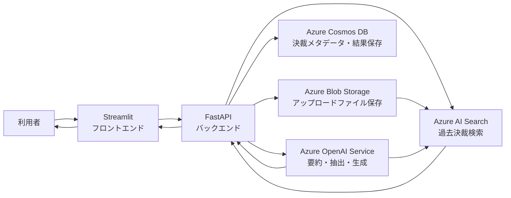
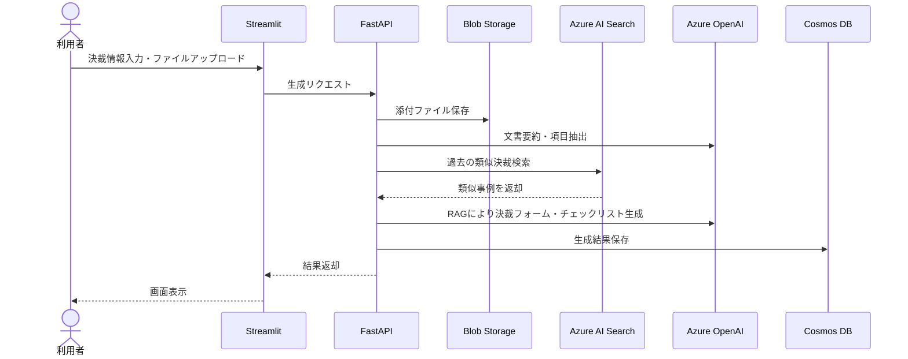
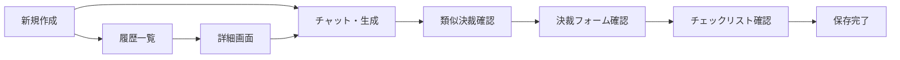

# 決裁RAGアシスタント 発表・要約資料

## 1. テーマ

**生成AIを活用した決裁提出書類の自動作成Webアプリケーション**

請求書、見積書、契約書などの決裁関連書類をアップロードすると、AIが内容を要約し、金額・取引先・日付・決裁科目番号などの入力項目を抽出する。さらに、Azure AI Searchで過去の類似決裁を検索し、その結果を根拠として決裁入力フォーム案と確認チェックリストを生成する。

## 2. 解決したい課題

- 決裁申請に必要な項目を人が手作業で整理するため、時間がかかる
- 過去の類似決裁を探しにくく、記載方法が担当者ごとにばらつく
- 添付書類の漏れ、金額の不一致、決裁科目番号の誤りが発生する可能性がある
- 社内に蓄積された決裁データが十分に再利用されていない

## 3. 目的

- 決裁書類作成にかかる時間を短縮する
- 過去の類似決裁を参考にして、記載品質を向上させる
- 必要な添付書類や確認タスクを自動でチェックリスト化する
- 生成結果と参照根拠を保存し、再利用可能な社内ナレッジとして蓄積する

## 4. システム構成

## 5. データフロー

## 6. 主な機能

| 機能 | 説明 |
|---|---|
| 決裁情報入力 | タイトル、内容、金額、決裁科目番号を入力する |
| ファイルアップロード | 請求書、見積書、契約書などをアップロードする |
| 文書要約 | アップロード文書の重要内容をAIが要約する |
| 項目抽出 | 金額、取引先、日付、請求番号などを抽出する |
| 類似決裁検索 | Azure AI Searchで過去事例を検索する |
| チェックリスト生成 | 必要書類、確認事項、作業タスクを生成する |
| 決裁フォーム生成 | 決裁システムに入力しやすい形式の草案を生成する |
| 結果保存 | Cosmos DBに生成結果と参照根拠を保存する |

## 7. 画面遷移

## 8. 想定出力例

- 決裁タイトル: `ABC株式会社 クラウド利用料支払に関する決裁`
- 要約: `添付された請求書によると、2026年6月分のクラウド利用料120,000円について支払決裁が必要である`
- 抽出項目: 取引先、金額、請求日、支払期限、決裁科目番号
- 類似決裁: 過去のクラウド利用料支払決裁3件
- チェックリスト:
  - 請求書の金額と入力金額が一致しているか確認する
  - 見積書または契約書が添付されているか確認する
  - 決裁科目番号が過去事例と矛盾していないか確認する
- 決裁本文案: `業務システム運用に必要なクラウド利用料について、添付請求書に基づき支払決裁を申請します。`

## 9. PBLでの実装範囲

### 必須実装

- Streamlit画面
- FastAPI API
- Azure OpenAI呼び出し
- Azure AI Searchによる類似検索
- Blob Storageへのファイル保存
- 決裁フォーム、要約、チェックリストの生成

### 可能であれば実装

- Cosmos DBへの保存
- 履歴照会
- 生成結果の修正・保存
- Markdown/CSVエクスポート

## 10. 発表用一文

本システムは、決裁関連書類をアップロードすると、生成AIが文書内容を要約し、Azure AI Searchで過去の類似決裁を検索して、決裁入力フォーム案と確認チェックリストを自動生成するRAG型の業務効率化アプリケーションです。
