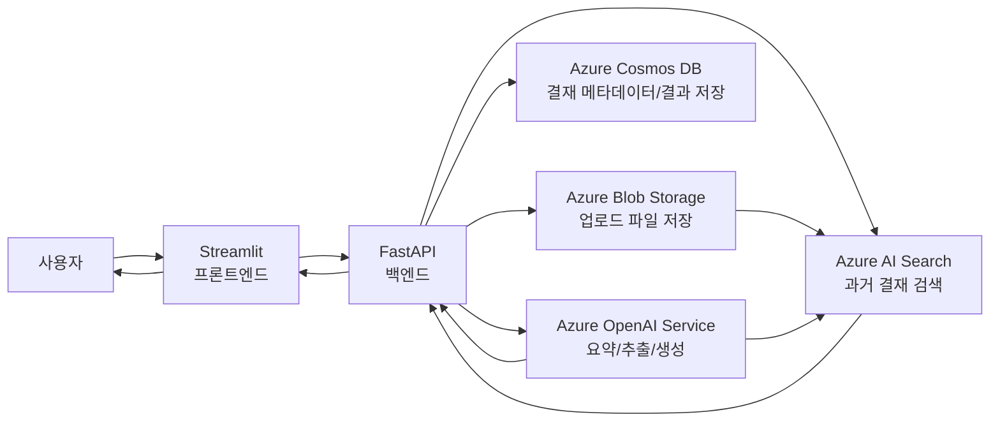
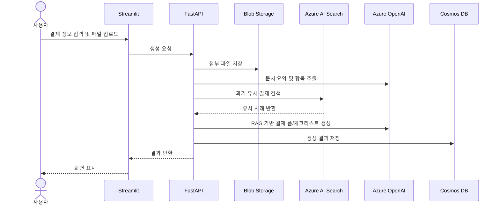

# 결재 RAG 어시스턴트 발표/요약 자료

## 1. 주제

**생성AI를 활용한 결재 제출서류 자동 작성 Web 애플리케이션**

청구서, 견적서, 계약서 등 결재 관련 서류를 업로드하면 AI가 내용을 요약하고, 금액/거래처/날짜/결재과목번호 등의 입력 항목을 추출한다. 이후 Azure AI Search로 과거 유사 결재 사례를 검색하고, 그 결과를 근거로 결재 입력 폼 초안과 확인 체크리스트를 생성한다.

## 2. 해결하려는 문제

- 결재 신청 시 필요한 항목을 사람이 직접 정리해야 해서 시간이 많이 걸림
- 과거 유사 결재를 찾기 어렵고, 작성 방식이 담당자마다 달라짐
- 첨부서류 누락, 금액 불일치, 결재과목번호 오류가 발생할 수 있음
- 사내에 축적된 결재 데이터가 재사용되지 못함

## 3. 목표

- 결재 문서 작성 시간을 단축
- 과거 유사 결재 기반으로 작성 품질 향상
- 필요한 첨부서류와 확인 태스크를 자동 체크리스트화
- 생성 결과와 참조 근거를 저장하여 재사용 가능한 지식 데이터로 축적

## 4. 시스템 구성

## 5. 데이터 흐름

## 6. 주요 기능

| 기능 | 설명 |
|---|---|
| 결재 정보 입력 | 제목, 내용, 금액, 결재과목번호 입력 |
| 파일 업로드 | 청구서, 견적서, 계약서 등 업로드 |
| 문서 요약 | 업로드 문서의 핵심 내용을 AI가 요약 |
| 항목 추출 | 금액, 거래처, 날짜, 청구번호 등 추출 |
| 유사 결재 검색 | Azure AI Search로 과거 사례 검색 |
| 체크리스트 생성 | 필요 서류, 확인사항, 작업 태스크 생성 |
| 결재 폼 생성 | 결재 시스템에 입력 가능한 형태의 초안 생성 |
| 결과 저장 | Cosmos DB에 생성 결과와 참조 근거 저장 |

## 7. 화면 전이

## 8. 예상 출력 예시

- 결재 제목: `ABC株式会社 클라우드 이용료 지급 결재`
- 요약: `첨부된 청구서에 따르면 2026년 6월 클라우드 이용료 120,000엔에 대한 지급 결재가 필요함`
- 추출 항목: 거래처, 금액, 청구일, 지급기한, 결재과목번호
- 유사 결재: 과거 클라우드 이용료 지급 결재 3건
- 체크리스트:
  - 청구서 금액과 입력 금액이 일치하는지 확인
  - 견적서 또는 계약서가 첨부되었는지 확인
  - 결재과목번호가 과거 사례와 일치하는지 확인
- 결재 본문안: `業務システム運用に必要なクラウド利用料について、添付請求書に基づき支払決裁を申請します。`

## 9. PBL 구현 범위

### 필수 구현

- Streamlit 화면
- FastAPI API
- Azure OpenAI 호출
- Azure AI Search 유사 검색
- Blob Storage 파일 저장
- 결재 폼/요약/체크리스트 생성

### 가능하면 구현

- Cosmos DB 저장
- 히스토리 조회
- 생성 결과 수정 후 저장
- Markdown/CSV 내보내기

## 10. 발표용 한 문장

본 시스템은 결재 관련 서류를 업로드하면 생성AI가 문서 내용을 요약하고, Azure AI Search로 과거 유사 결재를 검색하여, 결재 입력 폼 초안과 확인 체크리스트를 자동 생성하는 RAG 기반 업무효율화 애플리케이션입니다.
