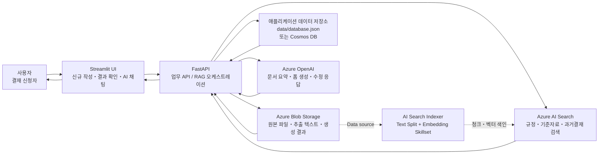
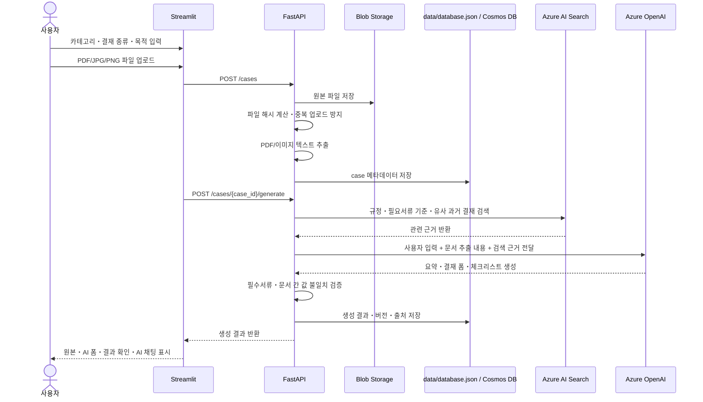
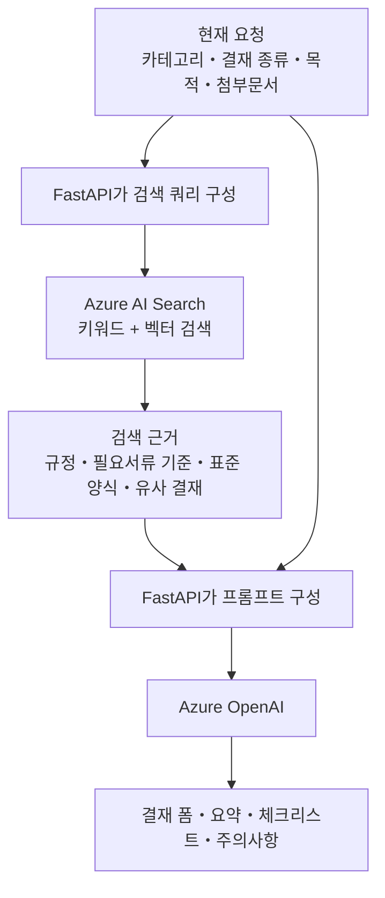
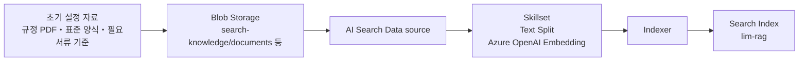
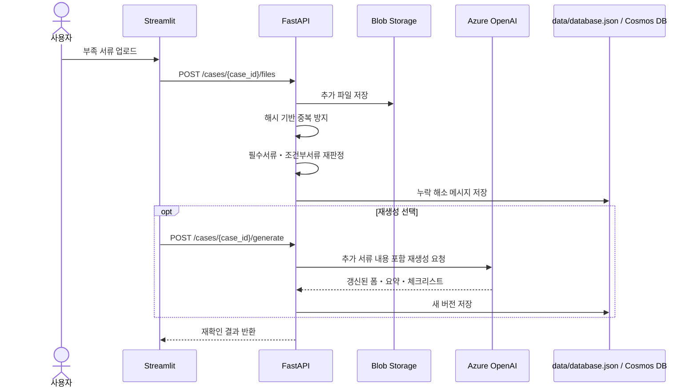
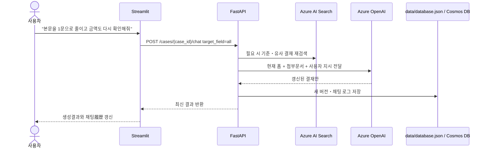

# 결재 RAG 어시스턴트 시스템 구성도

> 발표자료용 설명 문서입니다. 사용자가 파일을 업로드하고 AI와 대화할 때, Streamlit, FastAPI, Blob Storage, Azure AI Search, Azure OpenAI, 애플리케이션 데이터 저장소가 어떤 순서로 동작하는지 설명합니다.

## 1. 전체 구성

### 핵심 역할

| 구성요소 | 역할 |
|---|---|
| Streamlit UI | 사용자가 목적, 카테고리, 파일을 입력하고 생성 결과를 확인하는 화면 |
| FastAPI | 파일 저장, 텍스트 추출, RAG 검색, Azure OpenAI 호출, 저장을 제어하는 중심 서버 |
| Azure Blob Storage | 업로드 원본, 기준 자료, 추출 텍스트, 생성 결과를 보관 |
| Azure AI Search | 결재 규정, 필요서류 기준, 표준 양식, 과거 결재를 검색 |
| Azure OpenAI | 검색 결과와 현재 문서 내용을 바탕으로 요약, 결재 폼, 체크리스트, 수정 응답 생성 |
| data/database.json 또는 Cosmos DB | case, 작성 이력, 채팅 로그, 버전, 체크리스트 결과, 설정 메타데이터 저장 |

## 2. 신규 작성과 파일 업로드 흐름

## 3. RAG 검색 흐름

RAG는 Azure AI Search 안에서 모든 생성이 끝나는 구조가 아닙니다. AI Search는 “근거 검색”을 담당하고, FastAPI가 검색 결과와 현재 문서 내용을 조합하여 Azure OpenAI에 전달합니다.

### 검색 대상 우선순위

| 우선순위 | 데이터 | 설명 |
|---|---|---|
| 1 | 결재 규정・필수 입력 기준 | 반드시 따라야 하는 기준 |
| 1 | 필요서류 기준 | 청구서, 견적서, 계약서 등 누락 여부 판정 |
| 1 | 표준 양식・작성 가이드 | 결재 본문과 폼 구조 참고 |
| 2 | 승인된 과거 결재 | 표현, 금액대, 과목번호 후보 참고 |
| 3 | 본 앱의 작성 이력 | 재조회와 신규 작성 복사에 활용 |

## 4. Blob Storage와 AI Search 인덱서 흐름

현재 Azure 모드의 기본 방향은 Blob Storage에 저장된 자료를 Azure AI Search의 Data source, Skillset, Indexer로 가져와 검색 인덱스를 구성하는 방식입니다.

### 왜 이렇게 나누는가

| 항목 | 이유 |
|---|---|
| Blob Storage | 원본 파일을 안전하게 보관하고 인덱서가 읽을 수 있게 하기 위함 |
| Data source | AI Search가 Blob의 어떤 컨테이너/경로를 읽을지 정의 |
| Skillset | 긴 문서를 검색 가능한 청크로 나누고 벡터를 생성 |
| Indexer | Blob 변경 내용을 검색 인덱스로 반영 |
| Search Index | 실제 RAG 검색 시 FastAPI가 조회하는 대상 |

## 5. 결과 화면의 사용자 흐름

현재 UI는 사용자가 무엇을 해야 하는지 쉽게 이해하도록 세 영역으로 나뉩니다.

| 영역 | 사용자가 하는 일 | 시스템 처리 |
|---|---|---|
| 1. 생성결과표시 | 원본 문서와 AI 생성 결재 폼을 확인 | 원본 미리보기, AI 추출 필드, 개별 복사 제공 |
| 2. 결과확인 | 부족・주의, 비교표, 체크리스트를 필요할 때 펼쳐 확인 | 요약 카드로 상태를 먼저 표시하고 상세는 접힘 영역에 보관 |
| 3. AI채팅 | 자연어로 수정 지시 | `target_field=all`로 결재안 전체를 재검토・재생성 |

## 6. 추가 서류 업로드와 재확인 흐름

## 7. AI 채팅 수정 흐름

사용자는 수정 대상 셀렉트박스를 고르지 않고 자연어로 요청합니다.

## 8. 저장 위치 요약

| 데이터 | 저장 위치 |
|---|---|
| 업로드 원본 파일 | Azure Blob Storage `uploaded-documents` |
| 기준 자료 원본 | Azure Blob Storage `config-materials` 또는 AI Search용 Blob 경로 |
| 추출 텍스트 | Azure Blob Storage `extracted-texts` |
| 생성 결과 파일 | Azure Blob Storage `generated-outputs` |
| case, 작성 이력, 채팅 로그, 버전 | `data/database.json` 또는 Cosmos DB |
| 검색용 청크・벡터 | Azure AI Search Index |

## 9. 발표 시 설명 포인트

1. 사용자는 파일과 목적만 입력한다.
2. FastAPI가 파일 저장, 텍스트 추출, RAG 검색, AI 생성, 저장을 오케스트레이션한다.
3. AI Search는 답변을 생성하는 곳이 아니라 근거를 찾아주는 검색 계층이다.
4. Azure OpenAI는 현재 문서와 검색 근거를 바탕으로 폼, 요약, 체크리스트를 생성한다.
5. 결과 화면은 생성결과표시, 결과확인, AI채팅으로 나뉘어 사용자가 무엇을 해야 하는지 쉽게 알 수 있다.
